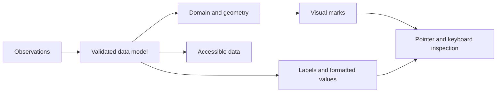
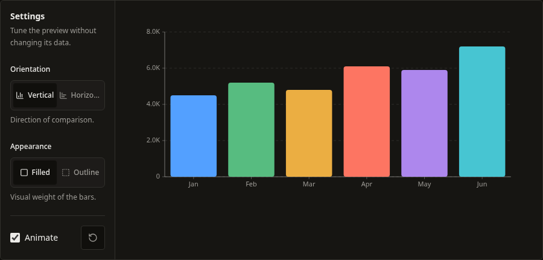
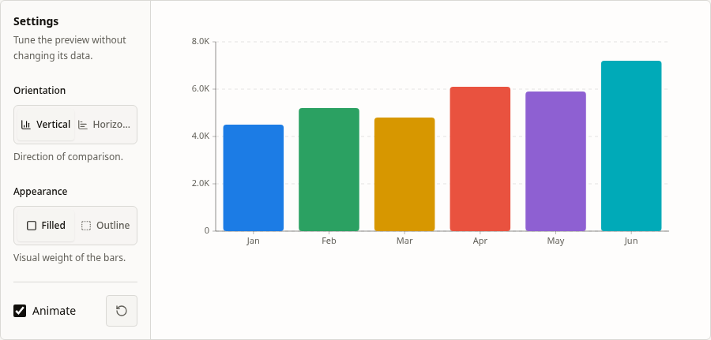
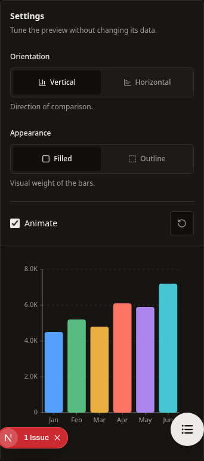
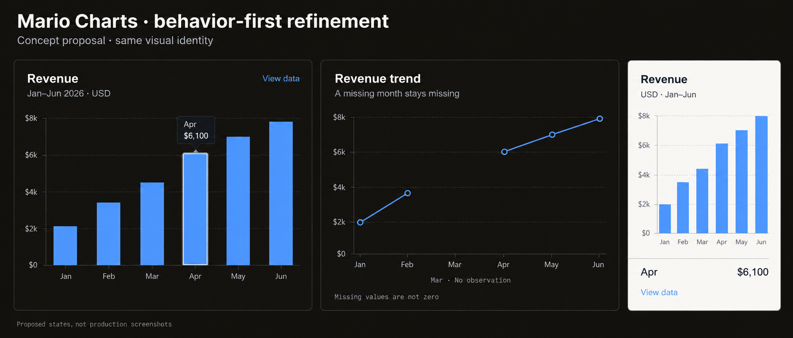
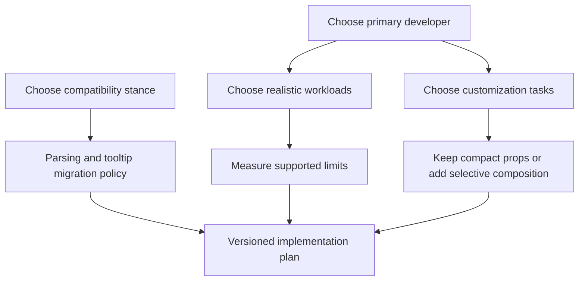

# Mario Charts: chart quality research and improvement plan

Research date: September 12, 2026. Repository baseline: `f5320be`.

Implementation follow-up: [BarChart v1](bar-chart-v1.md) records the subsequent, user-approved first implementation, its compatibility notes, screenshots, and validation. Findings below describe the original research baseline.

The subsequent [LineChart v1](line-chart-v1.md) records its implementation and validation. [AreaChart retirement](area-chart-v1.md) records the decision to remove the standalone component and use LineChart fills. [PieChart v1](pie-chart-v1.md) records the pie, donut, and semicircle pass. [RadarChart v1](radar-chart-v1.md) records the scale, animation, and inspection pass. [ScatterPlot v1](scatter-plot-v1.md) records the bubble, viewport, trend, and inspection pass. [StackedBarChart v1](stacked-bar-chart-v1.md) records the signed-stack, growth, and segment-inspection pass. [GaugeChart v1](gauge-chart-v1.md) records the range, zone, and live-arc pass. [Heatmap v1](heatmap-v1.md) records the missing-value, color-scale, weighted-area and inspection pass. [Heatmap stock v2](heatmap-stock-v2.md) records the subsequent label, palette, and layout correction. [FunnelChart and SankeyChart v1](funnel-sankey-v1.md) records the conversion layouts and the new branching-flow component. [TreeMapChart v1](treemap-v1.md) records the layout, hierarchy, navigation and label pass. [WaterfallChart v1](waterfall-v1.md) records the balance, checkpoint, growth and inspection pass, completing the twelve-chart sequence.

**Recommendation: preserve the visual identity, repair data correctness and lifecycle failures first, then standardize the developer and interaction contracts. A wholesale rewrite is not justified by this audit.**

This is a research and planning document. No chart, site, CLI, registry, or test implementation was changed. The screenshots show the current local application; the separate concept image illustrates proposed behavior and is not a production screenshot.

## 1. What we are deciding

The central question is: **what would make a developer trust these charts after the first attractive demo?**

There are two users. The developer needs to install, understand, customize, and maintain the component. The person reading the dashboard needs to interpret the data correctly and inspect it using their available device and input method. Quality requires both to succeed.

The current appearance is an asset. The weakest areas found here are data semantics, transitions between states, and consistency of interactions. Some visual changes follow directly from repairing these behaviors: a missing month becomes a gap; negative values appear on the other side of zero; keyboard focus produces a usable tooltip. These are improvements in communication, even when typography, palette, and framing stay familiar.

Two questions were presented during research and remain open at the time of writing:

| Decision | Working recommendation | What a different answer changes |
| --- | --- | --- |
| Primary developer | Teams building ordinary SaaS dashboards | Bespoke visualization teams raise composition needs; large analytics workloads raise renderer and scale requirements |
| Compatibility | Preserve existing APIs where practical; propose selective migrations | A major-version reset permits more renaming, but increases consumer migration work |

These are planning assumptions, not approvals. The user has authorized research and documentation only. An installed first-principles skill was not found; the reasoning method below was applied directly. Component brainstorming and grilling skills informed the research and decision questions.

## 2. First principles: what makes chart code good?

A chart transforms observations into visual evidence. Its implementation should preserve meaning through every transformation:

The visual marks, tooltip, and accessible representation should describe the same observation. If they disagree, adding polish does not repair the chart.

| Principle | What good looks like | What bad looks like | Why developers care |
| --- | --- | --- | --- |
| Preserve meaning | Missing, zero, invalid, and negative values have explicit policies | A parser silently converts an absent observation into zero | They cannot confidently use the component with real API responses |
| Honor the API | Every option produces the documented behavior | `step` renders a straight diagonal line | Types create confidence the implementation has not earned |
| Compose reliably | Works through loading, errors, resizing, and multiple instances | Only renders when data exists on the first mount | Ordinary application state becomes an integration trap |
| Keep input methods equivalent | Keyboard and touch can inspect what hover reveals | Removing visible dots removes keyboard access | A visual preference silently changes functionality |
| Make ownership practical | Data math is understandable and independently testable | Fixing one behavior requires editing a large rendering function in several charts | Copying code transfers maintenance responsibility to the consumer |
| Use a shared vocabulary | Familiar formatting, tooltip, and state conventions | The same field means a number in one chart and formatted text in another | Switching chart types requires unnecessary relearning |
| Preserve visual clarity | Units, domains, labels, color, and motion support the comparison | Labels collide or smoothing implies an unobserved trend | The component may look good while communicating poorly |
| Measure constraints | Supported datasets and performance are measured | “60fps” or “10k points” is asserted without a workload | Consumers make architecture choices on unsupported promises |

Good code is not defined by file length, number of hooks, or abstraction count. A short function that invents observations is worse than a longer, well-tested function that preserves them. Equally, a generic chart engine can become harder to copy and modify than a few small, explicit helpers.

## 3. Research method and confidence

The audit read all twelve chart implementations, their mathematical helpers and tests, shared tooltip/resize utilities, the manifest and shadcn emitter, CLI installation smoke checks, CI configuration, and the current bar-chart documentation page. Current library documentation was researched directly, rather than relying on remembered features.

Evidence labels used below:

- **Reproduced:** an isolated runtime probe demonstrated the behavior.
- **Source-verified:** the implementation establishes the behavior or inconsistency; a full browser/assistive-technology test was not performed.
- **Hypothesis:** a plausible concern that needs measurement or user validation.

Existing checks run during this research: `npm run test -- --runInBand src/components/charts registry packages/cli/src/utils`. **31 suites and 389 tests passed.** This is a focused baseline, not a complete release gate or a coverage measurement.

Additional probes used Node stdin, TypeScript transpilation, jsdom, React Testing Library, and mocked Framer Motion, without adding repository files. These establish lifecycle and generated-geometry failures; they do not measure browser animation performance. The local Next.js application was opened in Chromium to capture the current bar-chart panel at desktop and mobile widths, plus light theme.

Not completed here: a screen-reader certification pass, a twelve-chart browser visual regression suite, comparative bundle measurements, real-device performance benchmarks, or a new clean-project install matrix. Their absence is reflected in the confidence labels and the proposed acceptance gates.

Deliverable verification: all local document/image links resolve; `git diff --check` reports no whitespace errors. The pre-existing `package-lock.json` modification was left untouched. Only this research directory was added.

## 4. What other libraries do well—and what to borrow

These are pattern references, not a universal ranking. No competitor was benchmarked against Mario Charts under identical workloads. Feature availability and documentation were checked on the research date.

### Five technical references

| Reference | Observed pattern | Why it is useful | Transfer to Mario Charts | Tradeoff to avoid copying automatically |
| --- | --- | --- | --- | --- |
| [shadcn/ui Chart](https://ui.shadcn.com/docs/components/base/chart) | Recharts composition with chart configuration kept separate from observations; CSS color tokens shared by visual elements | Developers can reuse labels/colors and reach the underlying chart primitives | A consistent series identity/configuration model; small optional customization points | Replacing our implementation with Recharts merely to imitate their API; imposing verbose composition on every basic chart |
| [Tremor Line Chart](https://www.tremor.so/docs/visualizations/line-chart) | A dashboard-oriented interface with data, index, categories, value formatting, and examples of interaction callbacks; its source includes broader invisible click targets | Common dashboard tasks require little setup; targets can be usable without visibly thick lines | Formatter support, useful recipes, stable selection payloads, generous invisible hit areas | Copying every option, dependency, or permissive internal type from the reference |
| [Nivo Line](https://nivo.rocks/line/), [Bar](https://nivo.rocks/bar/), and [FAQ](https://nivo.rocks/faq/) | Documented missing-value holes, signed bar examples, and explicit SVG/Canvas alternatives | Semantics and renderer choices are visible product contracts | Gap and signed-domain fixtures; clear supported-workload guidance | Adopting Canvas before establishing a real workload that requires it; assuming all renderer capabilities are equivalent |
| [MUI X accessibility](https://mui.com/x/react-charts/accessibility/) | Documented arrow navigation, focus visualization, reduced-motion behavior, and localized descriptions; keyboard activation is separately opt-in in the reviewed version | Accessibility becomes a specific interaction model that can be tested | A chart-level navigation contract independent of visible markers | Assuming every interaction is automatically accessible, or importing MUI's styling/platform assumptions |
| [visx](https://visx.airbnb.tech/) | Modular, low-level React visualization primitives, intentionally leaving styling, animation, and state decisions to the integrator | The boundary between reusable mathematics and product decisions is explicit | Small internal geometry/scale utilities behind simple ready-made charts | Turning Mario Charts onboarding into a task of assembling a visualization framework |

**Synthesis:** Mario Charts can keep a compact ready-made API while adopting more explicit semantics, a shared metadata vocabulary, and selective extension points. None of these observations requires a renderer replacement.

### Product and visual references

[PostHog Trends](https://posthog.com/docs/product-analytics/trends/overview) demonstrates the same metric as a total, a time trend, and a breakdown, and marks a still-collecting period with a dotted line. The transferable idea is to make the interpretation and completeness of data visible. Its query builder and analytics navigation belong to the host application, not inside a copied chart component.

[Layers Explore](https://layers.to/explore) and the search result for [Dashboard — Analytics by Antonin Kus](https://layers.to/layers/cmmgs1mh8000ele0dzugj0j29) were checked as the craft-reference bucket. The shot could not be opened reliably, so it is **not used as evidence of a visual pattern or as a claimed inspected reference**. The visual proposal instead follows the inspected local interface and the documented chart references above.

For accessible descriptions, [W3C's complex images guidance](https://www.w3.org/WAI/tutorials/images/complex/) provides an additional foundation: readers need the essential information represented by the chart, including detailed data when appropriate. An accessible table is a useful complement to interaction, not a reason to leave interactions inaccessible.

## 5. Preserve these existing strengths

There is already substantial work worth retaining:

- **Direct code ownership and small dependency scope.** The manifest declares Framer Motion for charts and clsx/tailwind-merge through the shared class helper. React/ReactDOM are peers; Tailwind styling is a consumer prerequisite. Recharts, Radix, GSAP, and other site dependencies in the workspace package are not evidence of published chart dependencies. See the [manifest](../../../registry/manifest.js).
- **A useful common baseline.** Most props already use readonly data, typed keys, loading/error/animation controls, and typed callbacks. The existing `tooltipRenderer` is a useful escape hatch.
- **Mathematical modules we can learn from internally.** Scatter, Radar, Gauge, TreeMap, and Waterfall already separate important calculations from rendering. Waterfall's cumulative model is a particularly useful reference for defining value-space semantics before pixel geometry.
- **An established testing foundation.** Every chart family has tests. The problem is the missing behavioral scenarios, not that testing must start from nothing.
- **A considerably improved distribution system.** A single manifest drives chart artifacts, import rewriting is tested, and CI detects stale generated files. Preserve these safeguards as internals change.
- **An attractive and coherent presentation.** The current chart panel uses restrained borders, readable typography, quiet axes, and clear data marks. All twelve chart implementations call `useReducedMotion`; the shared tooltip already respects that preference. Coverage of motion states still needs improvement.

## 6. Findings that should drive the plan

### F1 — A normal loading-to-data transition can strand every chart

**Priority: P0. Confidence: reproduced across all twelve charts.**

The shared measurement hook runs once. When a chart initially returns its loading state, the measured element does not exist, so the effect exits. Changing `loading` to false creates the element, but does not rerun the effect. The chart remains at zero measured width and displays its width-waiting placeholder.

This is an everyday application flow: render a chart while a request is pending, then provide the result. The consumer should not have to change the component key or force a remount to obtain a chart.

Evidence: [shared hook](../../../src/components/charts/_shared/hooks.ts) lines 6–18; [Area's duplicate hook](../../../src/components/charts/area-chart/index.tsx) line 113; representative early branches in [Bar](../../../src/components/charts/bar-chart/index.tsx) line 261. The runtime loading→ready probe produced zero SVG elements for every chart. Other initial branches with the same missing-ref structure need equivalent regression cases.

**Proposed change:** retain a measured outer shell through state changes, or use a callback-ref lifecycle that observes the actual attached node. A state-shell solution can also fix inconsistent dimensions. Test loading→ready, error→ready, empty→ready, ready→loading→ready, and initially hidden containers becoming visible.

### F2 — Missing values can imply observations that never happened

**Priority: P0. Confidence: reproduced for Line; matching source in Area.**

The line-generation logic retains missing points when `connectNulls` is true and gives them the chart-bottom coordinate. When false, it removes the missing points and joins the remaining ones into one path. The first case invents a downward point; the second implies an uninterrupted observation path.

Evidence: [Line](../../../src/components/charts/line-chart/index.tsx) line 50; [Area](../../../src/components/charts/area-chart/index.tsx) line 140.

| Input | Current behavior | Required contract |
| --- | --- | --- |
| A=10, B=null, C=20; `connectNulls=false` | Joins A directly to C | Separate valid segments; B remains unobserved |
| Same data; `connectNulls=true` | Includes B at the plot bottom | Bridge A to C without introducing a B value |
| B=0 | A real numeric observation | Draw and announce zero distinctly from missing |

**Proposed change:** represent valid segments explicitly, reuse that model for line and area geometry, and keep tooltip/table semantics consistent with it. Stacked areas need an explicit missing-value policy of their own; silently inserting zero should not be the universal answer.

### F3 — Signed values can disappear

**Priority: P0. Confidence: stacked bars reproduced in both orientations; Bar source-verified.**

For one stacked row with +100 and −100, the current vertical chart produces a negative segment of height zero; the horizontal version produces a positive segment of width zero. The calculation uses an absolute extent instead of a complete signed domain and then clamps the geometry. Plain Bar starts its domain at zero and also clamps negative lengths away.

Evidence: [StackedBar](../../../src/components/charts/stacked-bar-chart/index.tsx) lines 206, 243–261, 288–306; [Bar](../../../src/components/charts/bar-chart/index.tsx) lines 160–165, 210, 224.

**Proposed change:** use explicit minimum/maximum values and a mapped zero position. Accumulate positive and negative stacks separately. Both orientations should express the same quantities. Pie's rejection of negative data is a useful reminder that different chart types can have different valid input domains; unsupported data should be rejected clearly instead of erased.

### F4 — Some advertised curve options are not implemented as advertised

**Priority: P1, with F2. Confidence: source-verified.**

`linear`, `step`, and `natural` route through the same straight-line generation in Line and Area. The custom `monotone` calculation also needs mathematical verification: averaging slopes without a monotonicity limiter does not establish that the curve preserves monotonicity.

Evidence: [Line](../../../src/components/charts/line-chart/index.tsx) lines 53–80 and [Area](../../../src/components/charts/area-chart/index.tsx) lines 143–169.

**Proposed change:** implement and verify each promised curve, or deliberately deprecate unsupported options. The default curve should follow the data's meaning. A smoothed curve is a visual interpolation, not additional measured evidence.

### F5 — Valid theme colors and multiple instances are not consistently safe

**Priority: P1. Confidence: TreeMap reproduced; other concerns source-verified.**

TreeMap appends a hex opacity suffix to every input color. Supplying `var(--chart-1)` emits `var(--chart-1)d9`, an invalid CSS color. The landing page already contains a workaround that avoids passing its token palette to TreeMap. This is a direct connection between internal code quality and the ability to preserve our visual system.

Evidence: [TreeMap color helper](../../../src/components/charts/treemap-chart/index.tsx) line 41; [landing workaround](../../../components/landing/chart-index/chart-index-section.tsx) line 180. Heatmap's interpolation parser at [line 84](../../../src/components/charts/heatmap/index.tsx) also assumes hex even though its color props accept strings.

Line and Area gradient IDs are based on series index rather than instance identity. Duplicate IDs across two same-type charts are source-verified; actual cross-instance paint behavior still needs browser testing. See [Line](../../../src/components/charts/line-chart/index.tsx) lines 325/332 and [Area](../../../src/components/charts/area-chart/index.tsx) line 544.

**Proposed change:** keep color and opacity separate where SVG allows it; define accepted interpolation colors explicitly for Heatmap; use instance-safe SVG resource IDs. Test hex, short hex, CSS variables, rgb, and oklch according to the declared contract, including two charts with different palettes on one page.

### F6 — Interaction quality changes with chart variant and visual settings

**Priority: P1. Confidence: source-verified; screen-reader behavior requires dedicated testing.**

Line and Area place keyboard behavior on visible dots. Hiding the dots leaves hover regions without equivalent keyboard access. Heatmap has grid arrow navigation, but its radial and stock variants do not have the same keyboard path. Grid focus sets the hovered cell without establishing a tooltip position. Gauge's tooltip and Radar's axis actions are mouse-oriented.

Evidence: [Line](../../../src/components/charts/line-chart/index.tsx) lines 445–496; [Heatmap](../../../src/components/charts/heatmap/index.tsx) lines 393, 440, 556, 698, 1025; [Gauge](../../../src/components/charts/gauge-chart/index.tsx) line 200; [Radar](../../../src/components/charts/radar-chart/index.tsx) lines 415 and 618.

Many charts also place focusable descendants inside an SVG with `role="img"`. Test the resulting accessibility tree and announcement behavior with actual assistive technology before making broad conformance claims.

**Proposed change:** define navigation independently of whether markers are drawn. Prefer a bounded number of Tab stops and documented arrow navigation for dense charts; keep Enter/Space equivalent to the exposed activation action. Focus should derive tooltip placement from geometry and show an explicit visual indicator. Add a chart description and an accessible data representation. Test touch inspection separately; hover handlers do not demonstrate a complete touch experience.

### F7 — Heatmap needs a stricter data contract

**Priority: P1. Confidence: source-verified.**

Heatmap builds all combinations of its row and column categories. Missing pairs become zero-valued cells, and their callback payload is an empty object cast to the consumer's generic type. Duplicate coordinates overwrite prior entries. These are product decisions currently embedded in processing logic.

Evidence: [Heatmap](../../../src/components/charts/heatmap/index.tsx) lines 864–881, 941, 1018. Diverging colors in grid/radial modes use the midpoint of observed min/max, which is not necessarily zero. Stock mode has a different zero-centered model.

**Proposed change:** distinguish absent cells from zero, define duplicate handling, never manufacture a supposedly valid source row, and document the color domain/midpoint. An explicit empty-cell payload can be useful, but it must be accurately typed. Whether duplicates sum, average, or fail should be decided from the chart's purpose rather than chosen silently.

### F8 — Numeric parsing and display conventions hide important decisions

**Priority: P1. Confidence: source-verified.**

The shared parser removes commas, currency symbols, percent signs, and whitespace, then uses `parseFloat`; failure becomes zero in one helper and null in another. For example, `12abc` is accepted as 12, while `1,5` becomes 15. A string such as `15%` is interpreted as 15; whether that means percentage points or a fractional ratio is left implicit.

Evidence: [shared utilities](../../../src/components/charts/_shared/utils.ts) lines 12–35; Area duplicates parsing and formatting internally. The basic Bar/Line/Area interfaces also lack a consistent public formatter for axes and default tooltip values. Replacing a tooltip alone does not fix units on the axis.

**Proposed change:** normalize API data before plotting, make coercion deliberate, and offer consistent value/axis formatting. For compatibility, consider deprecating permissive parsing with actionable development diagnostics before changing defaults. Separate raw value, numeric value, formatted value, and source datum in the public contract.

The tooltip types already show drift: Line's shared series `value` is numeric; Area's exported local tooltip series `value` is formatted text. There is also a separate shared Area tooltip declaration with a different shape. See [shared tooltip types](../../../src/components/charts/_shared/tooltip-types.ts) and [Area's local type](../../../src/components/charts/area-chart/index.tsx) lines 11–19. Unify meaning before unifying names.

### F9 — State shells and motion need the same attention as ready charts

**Priority: P1. Confidence: source-verified.**

Several error/empty states hard-code `h-64` rather than preserving the requested chart height and className. A dashboard with a 400px ready chart can therefore change layout when it becomes empty. Line and Area loading paths loop independently of their chart animation/reduced-motion settings.

Evidence: [Bar state components](../../../src/components/charts/bar-chart/index.tsx) lines 101/112; [Line loading animation](../../../src/components/charts/line-chart/index.tsx) line 114; [Area loading animation](../../../src/components/charts/area-chart/index.tsx) line 203.

**Proposed change:** a stable outer frame, accessible state announcements, dimension-preserving content, and a reduced-motion loading representation. Keep fetching and retry policy in the host application; expose enough composition for a real retry action when one exists.

### F10 — The remaining performance and verification gaps need measurement

**Priority: P2 after correctness. Confidence: architectural risks, not measured performance failures.**

Line/Area can create labels, hit regions, and markers per observation. Heatmap creates a category cross-product and performs label lookup inside nested loops. Stacked Area recomputes preceding-series sums for each series. Some entrance delays grow with item count. These are reasons to benchmark, not evidence of a particular frame rate.

Useful evidence: [Area stack computation](../../../src/components/charts/area-chart/index.tsx) lines 360–374; [Heatmap processing](../../../src/components/charts/heatmap/index.tsx) lines 867–876; [TreeMap animation delay](../../../src/components/charts/treemap-chart/index.tsx) line 198. Heatmap already caps grid stagger, an existing pattern to reuse.

The repository contains no discovered `*.stories.*` files despite Storybook scripts and guidelines. CI has test/typecheck/build/registry gates, but lint is advisory. The [CLI smoke test](../../../packages/cli/scripts/smoke-test.js) checks files, imports, and package presence; it does not compile and visually render the installed chart in a consumer app. These are specific gaps beyond the safeguards already present.

**Proposed change:** add correctness fixtures and browser scenarios first; measure rendering, pointer/focus updates, resize, memory, and bundle impact under declared conditions. Strengthen installation checks with actual consumer compilation. Choose downsampling or another renderer only when the measurements and target users warrant it.

## 7. Chart-by-chart working backlog

All twelve need the F1 lifecycle fix. This table adds chart-specific work; an item listed as “validate” is not a proven bug.

| Chart | Keep | Fix or adapt next | Validate before expanding |
| --- | --- | --- | --- |
| BarChart | Compact `x`/`y` API, filled/outline, orientation, keyboard handlers | Signed domain; value formatting; stable states | Label density, long categories, small values, all-negative input |
| LineChart | Multiseries domain, typed row tooltip, gap-aware numeric parser | Actual gaps/curves; independent keyboard targets; unique IDs | Single point, all-null series, irregular timestamps, dense hover |
| AreaChart | Stacked/unstacked presentation, gradients | Same path repairs; remove divergent helper/type copies after semantics are agreed | Signed stacking, missing stack members, repeated cumulative work |
| ScatterPlot | Separate regression/scales, invalid-coordinate filtering, domain controls | Consistent inspection/formatting and action semantics | Bubble-size meaning, clipped domains, dense point budget |
| PieChart | Negative-data rejection, full-circle handling, keyboard slices | Shared states, descriptions, formatting | Inner-radius bounds, all-zero input, small slices, label readability |
| RadarChart | Separate geometry/scales, per-axis ranges, minimum-axis validation | Keyboard axis actions; consistent focus tooltip; stronger key typing | Comparability of axes and units; axis ordering; many labels |
| StackedBarChart | Typed segments, orientations, callbacks | Mixed-sign domain and accumulation; replace swallowed processing failures with an explicit policy | All-zero stacks, all-negative stacks, normalized percentages |
| GaugeChart | Pure tested helpers, zones, clear invalid-range error | Focus-accessible inspection; shared state frame | NaN/infinite values; zone gaps/overlaps; out-of-range meaning |
| HeatmapChart | Three variants, grid arrow logic, capped grid stagger | Missing/duplicate semantics; truthful payloads; keyboard parity; color contracts | Sparse large matrices; explicit diverging midpoint; variant equivalence |
| FunnelChart | Multiple orientations/treatments, conversion-rate options | Shared state/formatting conventions | Zero first stage, negative stages, increasing stages, conversion denominator |
| TreeMapChart | Pure hierarchy/layout helper, positive finite node values | CSS color support; reliable focus tooltip | Deep/small rectangles, readable text, layout budget |
| WaterfallChart | Pure cumulative model, total-reset semantics, signed domain, group semantics | Shared lifecycle/state improvements; stable formatting/inspection | Totals after filtering, alternate orientation, long labels |

One additional contract question crosses Line and Area: their horizontal positions are currently derived from array index, so dates are equally spaced categories. Irregular timestamps are not automatically a continuous time scale. Document this now; add explicit time-scale support only if target use cases require it. See [Line's x calculation](../../../src/components/charts/line-chart/index.tsx) line 234.

## 8. Visual comparison and proposed direction

### Current implementation, captured locally

The screenshots below show the same existing documentation playground, not redesigned charts. Desktop viewport: 1440px; mobile viewport: 390px. The site's default theme is dark. The light screenshot uses the existing light theme. Reduced motion was requested during capture. The mobile capture includes the site's floating controls/development indicator; these are outside the published chart.

**Desktop, default dark theme**

**Desktop, existing light theme**

**Mobile, existing layout**

The visible strengths are clear marks, quiet framing, a coherent palette, and a layout that moves controls above the plot on mobile. The desktop orientation control truncates its second label at the captured width; that is a documentation-control issue, not a chart-renderer failure. The chart labels are intentionally small; readability at dense data and zoom levels remains a validation task, not a conclusion drawn from this one screenshot.

### Proposed concept

The concept is described in [the visual brief](visual-brief.md), including its generation prompt. It uses illustrative data different from the current screenshots and is not a geometry specification. The data contracts and acceptance criteria in this document take precedence over any generated visual detail.

| Preserve | Refine | Reason |
| --- | --- | --- |
| Geist typography, warm neutral surfaces, quiet borders | Add readable unit and context labels where required | A numeric axis alone does not say whether values are dollars, users, or percentages |
| Existing blue/green/amber/coral/violet/cyan palette | Allow stable series identities; demonstrate single-color encoding for a single quantity | Color should communicate identity or emphasis rather than change because input order changed |
| Filled and outline variants | Keep a visible zero baseline when magnitude is encoded by bar length | The visual comparison must reflect signed values correctly |
| Subtle entrance motion | Bound total animation time and provide a static reduced-motion path in every state | Dashboard readability should not depend on waiting through item-count-dependent delays |
| Compact tooltips | Keep focus/touch inspection inside available space | Information must remain readable at chart edges and on narrow screens |
| Minimal chrome | Offer data/description through optional host composition | Detailed inspection should be reachable without making every chart a control panel |

The proposed single-color revenue example is a choice to review, not a recommendation to delete the current multicolor style. Similarly, “View data” illustrates an optional integration pattern; it is not a new required button inside every copied chart.

## 9. Architecture options: improve, adapt, or replace

| Option | Benefit | Cost and risk | Recommendation |
| --- | --- | --- | --- |
| Patch each chart separately | Quick isolated fixes | Behavior drifts again; shared bugs get fixed unevenly | Appropriate for urgent narrow defects, insufficient as the overall plan |
| Small shared behavior/math modules behind current ready-made charts | Reuses correctness, keeps short examples and readable ownership | Shared changes need contract tests and dependency-aware installation checks | **Preferred direction** |
| Public compound-component architecture everywhere | Maximum custom composition | Larger learning surface, migration cost, more internals consumers must understand | Prototype only where real customization tasks cannot fit existing APIs |
| Replace rendering with Recharts, visx, or another engine | Potentially delegates mature mathematical/interaction capabilities | Dependencies, styling/motion differences, migration, and continued adapter maintenance | No evidence yet to justify a library-wide replacement |

The preferred direction separates data normalization, scales/geometry, rendering, and inspection. Share only concepts whose semantics agree. A pie segment, a waterfall total, and a missing heatmap cell should not be forced into one misleading generic event shape.

Candidate shared pieces: an observed container/state shell, numeric-domain utilities, line segmentation and curve helpers, value formatting conventions, focus/selection logic, tooltip placement, and instance-safe SVG resources. Retain explicit chart-specific models and keep optional utilities out of a consumer's installation when they are not needed.

The repository instructions contain aspirational examples involving Canvas, virtualization, broad APIs such as `xAxis`, and performance budgets. The shipped charts mostly use `x`/`y`; the manifest and source are the factual baseline. Aspirational examples are not a reason to introduce those features or dependencies automatically.

## 10. Developer-experience changes worth prototyping

1. **A predictable formatting contract.** A developer should be able to format currency or percentages consistently in axis ticks, tooltip content, and accessible values. Decide whether one formatter covers all surfaces or whether axis compaction and detailed values need separate hooks.
2. **Stable series metadata.** Human labels, colors, units, and stable identifiers should not be recovered from array position or raw property names. Reuse Radar's explicit series identity where helpful without forcing every chart into Radar's data shape.
3. **Truthful tooltip and event types.** Preserve the original row where meaningful, distinguish raw/numeric/formatted fields, and model absence explicitly. Do not cast `{}` to a consumer's data type.
4. **Small extension points.** Keep `tooltipRenderer`; evaluate label/legend/empty-state composition against concrete consumer tasks. Avoid adding a large slot system merely for symmetry.
5. **Examples that survive integration.** Provide recipes for async data, custom units, nulls, signed data, multiple charts, theme tokens, and keyboard inspection. Each advertised option needs an example and a behavioral check.
6. **An explicit data envelope.** Document categorical versus continuous axes, accepted values, duplicate handling, clipping, and recommended dataset size once measured. Explain when a bar chart is a poor choice for hundreds of categories.

## 11. Delivery sequence and acceptance gates

Effort labels are relative planning estimates, not promised durations. S means a localized fix; M means shared behavior across several components; L means a cross-library change or compatibility work.

| Stage | Work | Effort | Dependencies | Done when |
| --- | --- | --- | --- | --- |
| 0 — Record contracts | Agree data semantics, user priority, compatibility stance; record baseline visual fixtures | S–M | Product decisions | Maintainers can state expected behavior for null, zero, invalid, and signed input |
| 1 — Restore trust | F1 lifecycle; F2 gap semantics; F3 signed domains | M | Stage 0 semantics | All chart loading transitions recover; paths preserve missingness; signed bars agree in both orientations |
| 2 — Match promises | F4 curves; F5 colors/IDs; F7 heatmap payloads; F8 numeric contract | M–L | Stage 1 models | Every exposed option has accurate documented behavior and meaningful regression coverage |
| 3 — Complete interaction | F6 keyboard/touch inspection; F9 state/motion consistency; formatter/type harmonization | L | Stable geometry and data contracts | Inspection works without visible dots or pointer hover; all states preserve layout and respect motion preferences |
| 4 — Prove integration | Consumer compile matrix, browser examples/Storybook, docs/type synchronization | M | Runs alongside stages 1–3 | Installed examples compile and render with declared peers; documentation reflects the shipped APIs |
| 5 — Tune measured limits | Workload benchmarks, label thinning, capped stagger; evaluate sampling/renderers if needed | M, potentially L | Correct baseline | Performance recommendations cite a measured workload and device; no speculative renderer rewrite |

Use Bar and Line as the first representative implementations: Bar exercises signed domains, interaction, and orientation; Line exercises missingness, curves, shared tooltips, and density. Use Waterfall as an internal reference for pure data modeling. Validate shared changes against all twelve before considering the stage finished.

### Minimum behavior fixtures

| Dimension | Cases | Assertion |
| --- | --- | --- |
| Lifecycle | loading/error/empty→ready; ready→loading→ready; hidden→visible | The measured plot recovers without a consumer remount |
| Data truth | zero/null/invalid, single observation, all-null, +100/−100, all-negative | Output geometry and inspection retain the documented meaning |
| Curves | Same small dataset under linear/step/natural/monotone | Shapes differ appropriately; promised monotonicity is respected |
| Colors and instances | CSS variables and supported CSS forms; two same-type charts | Valid paint values and unique resource references |
| Interaction | Keyboard without dots; each Heatmap variant; touch and chart edges | Same observation and action remain reachable; tooltip remains readable |
| States and motion | Different explicit heights; reduced motion while loading and ready | No unintended size change; no disallowed repeating motion |
| Readability | 320/390px cards, long labels, 200% zoom, light/dark | Essential values remain accessible without unintentional overlap |
| Installation | Supported React/Tailwind versions, default/custom aliases, CLI/shadcn paths | Consumer compilation succeeds and the chart actually renders |

A suggested performance investigation uses 12, 100, 1,000, and 10,000 observations where meaningful, plus sparse/dense heatmaps and multiple-chart pages. These are **measurement points, not support promises**. Record browser/device, production build, animation settings, visible marks, mount time, interaction latency, resize behavior, and memory. Choose acceptance budgets after the first benchmark and the target devices are agreed.

## 12. Compatibility and documentation plan

Distinguish implementation corrections from consumer-facing contract changes. Repairing a loading transition or unique ID usually does not require a new prop. Fixing missing-value paths or signed geometry changes visible output even when it is a bug fix, so release notes and before/after fixtures are still warranted.

Parsing defaults, tooltip field meanings, new duplicate rules, and removing advertised curves can break consumer assumptions. Prefer additive fields/options first, clear deprecations, and a bounded migration guide. If clean semantics cannot coexist with the old behavior, propose a versioned migration explicitly rather than hiding the change inside refactoring.

Later changes would touch:

- `src/components/charts/_shared/**` and affected chart directories, with behavioral tests beside implementations.
- `registry/manifest.js` when the copied dependency/file graph changes, and emitters if documentation/type generation needs improvement.
- `app/docs/components/**`, authored documentation, and demonstration stories/fixtures when APIs or behavior change.
- `packages/cli` consumer smoke/compile checks and integration examples when distribution contracts change.
- CI configuration to make new acceptance checks reproducible and eventually make lint blocking after existing debt is addressed.

Run `npm run build:registry` after later chart changes. Never manually repair generated `public/r`, markdown docs, llms artifacts, generated site data, or CLI fallback files. A copied chart should behave the same as the source that passed the repository checks.

For a release, run the repository-required lint, typecheck, test, and build gates plus the affected consumer/browser checks. Those implementation gates are future work; this research did not claim to run a full release build.

## 13. Decision tree for the next brainstorming round

The first frontier is the two product questions in section 1. Their answers determine the later decisions below; the recommendations here are deliberately provisional.

### Questions that stress-test the plan

| Question | Provisional recommendation | Why the answer matters |
| --- | --- | --- |
| Would we trade an attractive but misleading smooth line for a plainer truthful one? | Yes; correct the semantics and recover polish within that constraint | Establishes correctness as a release gate |
| Should a chart accept arbitrary formatted API strings by default? | Prefer normalized numbers; provide an explicit compatibility path for existing coercion | Determines validation and migration policy |
| What customization request actually requires a compound-component API? | Identify two real tasks before designing one | Prevents architecture driven by competitor imitation |
| Must zero extra chart dependencies remain a hard constraint beyond the existing stack? | Keep the current scope initially; evaluate any addition by bundle and maintenance evidence | Determines whether mathematical helpers are owned or delegated |
| Which workload do we want to claim publicly? | Ordinary dashboards first; benchmark before setting limits | Determines whether dense analytics features belong in scope |
| Should the default single-series bar palette change? | Preserve compatibility; demonstrate intentional single-color and categorical options | Separates a taste decision from a correctness fix |
| Does accessible data belong inside each chart or in a reusable companion? | Prototype a companion with a clear description link, while retaining chart interaction | Balances small components with usable detailed access |
| What would justify a complete rewrite? | Measured inability to meet required semantics, interaction, or customization within a maintainable structure | Gives the team a concrete threshold for changing direction |

The next implementation proposal should be narrower than this research: define Stage 1's exact contracts and fixtures, preserve the established appearance, and make the resulting behavior reviewable before expanding the public API.
