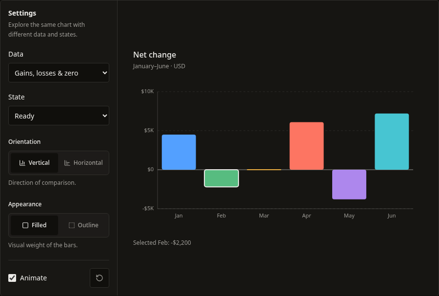
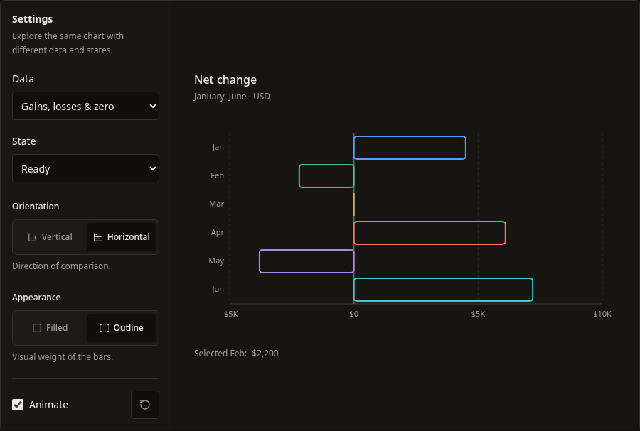
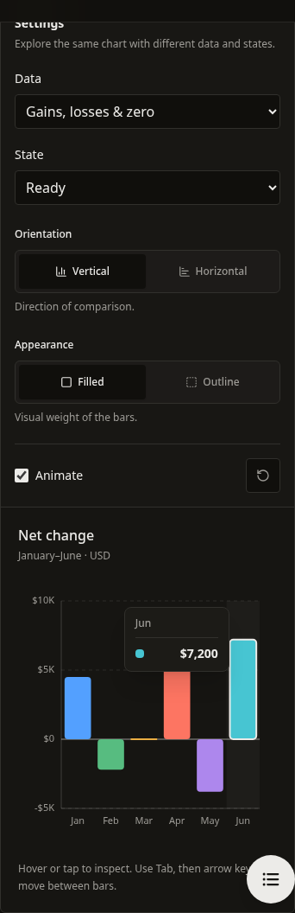
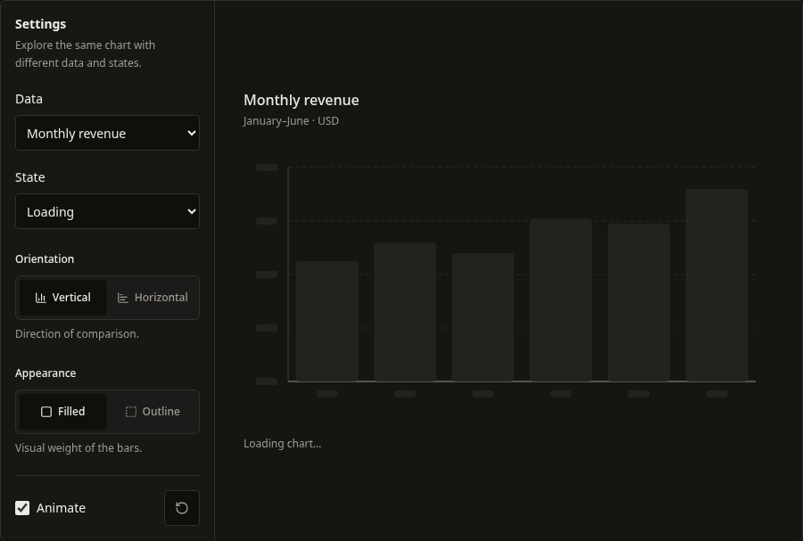
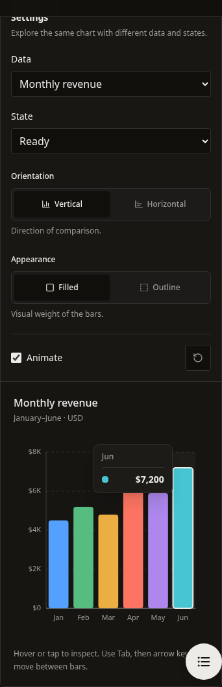

# BarChart v1: behavior and implementation changes

This implements the first BarChart pass from the chart-quality research. The remaining eleven charts are outside this implementation's scope.

## What changed and why

- The measured outer frame persists through loading, error, empty, and ready states. A normal asynchronous request no longer requires remounting the chart, and `height`/`className` apply consistently.
- `utils.ts` owns parsing, the signed domain, numeric scaling, and geometry. Bars, ticks, and the zero baseline use the same domain in both orientations. Pure mathematical tests can now check data truth without React or animation mocks.
- Negative values are visible on the correct side of zero. Zero has a baseline marker and a nonzero inspection target, while its actual bar still has zero length.
- One bar enters the Tab order. Arrow keys, Home, and End navigate; Enter/Space invoke a supplied `onBarClick`; Escape dismisses inspection. Filled and outline variants use the same interaction target. A chart without a click action does not advertise its bars as buttons.
- Value formatters cover default tooltips, visible values, and accessible labels. A separate optional axis formatter supports compact ticks. Existing custom tooltip payloads retain numeric values and original source rows.
- The tooltip measures its content and clamps its position to the chart frame. Labels shorten according to available space; full categories and values remain available through inspection. This first pass uses approximate text widths, not a full collision engine.
- Loading respects animation settings and reduced motion. Entrance stagger is capped at 400ms, rather than growing indefinitely with the number of bars. No new runtime dependencies were added.
- The documentation playground now includes signed, zero, and invalid datasets plus real state transitions. Storybook mirrors these scenarios. The registry and CLI distribute the two new helper files.

## Compatibility notes

Existing `x`, `y`, orientation, variant, colors, loading/error, callback, and custom-tooltip props remain. Four optional props are additive: `valueFormatter`, `axisValueFormatter`, `ariaLabel`, and `description`.

There is one deliberate data-policy correction: missing, invalid, nonfinite, or ambiguous numeric input displays an actionable error rather than being coerced to zero or partially parsed. Valid English-formatted strings remain accepted, including `"1,250.50"`, `"$1,250"`, `"15%"` (15 percentage points), and scientific notation. Strings such as `"12abc"`, `"1,5"`, empty strings, null, and undefined must be normalized or removed by the consumer. Categories also require the configured key to exist. For omitted `y`, the row must have a valid `value` field.

Applications that intentionally used missing values as zero should normalize those values explicitly before passing data. This visible behavior change should be mentioned in release notes.

Category order and index-based palette assignment are unchanged. Continuous/time axes, explicit stable category color IDs, a data-table companion, large-data renderers, and changes to the other chart families remain future work. This is not a claim of complete accessibility certification or a measured large-data performance guarantee.

## Where to review

- `/docs/components/bar-chart`: switch Data, State, Orientation, and Appearance; test keyboard and touch inspection.
- `Charts/BarChart` in Storybook: signed values, horizontal outline, zeros, missing values, currency, static motion, and state transitions.
- `src/components/charts/bar-chart/utils.test.ts`: numeric semantics and geometry, including extreme finite values.
- `src/components/charts/bar-chart/index.test.tsx`: public interaction and lifecycle behavior.

## Validation results

| Check | Result |
| --- | --- |
| Full Jest suite | 63 suites, 562 tests passed |
| TypeScript | `npm run typecheck` passed |
| Production build | `npm run build` passed, including registry and CLI builds |
| Storybook | `npm run build-storybook` passed with the committed configuration |
| Registry freshness | All 40 generated artifacts are current |
| Compiled CLI smoke test | Passed; expected helper files and dependencies were installed |
| Clean TypeScript consumer | BarChart installed through the compiled CLI; strict compile passed, including callback row inference and rejection of an invalid category key |
| Browser | Desktop/mobile, both orientations, outline/filled, signed/zero/invalid data, state transitions, keyboard selection/Escape and tooltip bounds passed; no page errors in the scenario run |
| Touch and motion | A real emulated touch tap inspected zero; light theme and reduced-motion loading/recovery passed |
| Scoped ESLint | All changed component, documentation, registry manifest, and Storybook files passed |
| Repository ESLint | Still fails on 30 existing errors outside this change; 39 warnings |
| CLI source watcher | `npm run dev:cli` fails loading the existing `unicorn-magic` dependency (`ERR_PACKAGE_PATH_NOT_EXPORTED`) under this environment's Node 26.7.0. The compiled CLI build, smoke test, and consumer installation passed |

The Storybook configuration selects a consistent local Webpack instance for Next and Storybook plugins; see the [upstream compatibility issue](https://github.com/storybookjs/storybook/issues/32301). No dependency was added to the published chart. The pre-existing workspace lockfile modification was not changed by this work.

## Implementation screenshots

Signed values, default visual treatment:

The same values in horizontal outline mode:

Mobile inspection kept inside the chart:

## Follow-up: entrance, loading, and hover

The initial browser review used reduced motion and did not verify the entrance. A subsequent real-motion, frame-by-frame check reproduced the reported center-origin bug: Framer Motion overwrote the raw SVG `transformOrigin`. Passing Motion's `originX`/`originY` with the zero coordinate fixes the cause. Across positive and negative bars, both orientations and both variants, maximum anchor drift fell from approximately 34px vertically / 74px horizontally to less than 0.001px. This check exercised actual browser transforms rather than Jest's Motion mock.

Loading now uses the same SVG, scale, margins, baseline, grid, category bands, bar dimensions, and corner radii as the ready chart. Numeric/category labels become neutral placeholders and bars keep their filled/outline treatment. With data retained during refresh, all bar bounds match exactly across loading and ready states; a browser check covered 16 combinations (1440px/390px, vertical/horizontal, filled/outline, positive/signed data). Before the first response, six neutral placeholders provide a consistent frame; the eventual category count and value-dependent label widths cannot be predicted. No invented values are exposed to assistive technology. Loading has no interaction targets and respects reduced motion and `animation={false}`. The playground and Storybook expose initial loading as well as refreshing existing data.

I inspected the [DataFast public demo](https://datafa.st/share/66d5711aa2f1fb254ce42c0b) directly with pointer interactions. Its main chart activates inspection anywhere within a category column, keeps the tooltip anchored when the pointer moves vertically in that column, and places it on the opposite side near the edge. The category header and aligned values also make the card easy to scan. The BarChart now adopts full-band inspection, a stable value anchor, measured side placement with edge clamping, and a category header above the value. Horizontal charts use the corresponding row band. Keyboard and bar-click behavior remain covered by the existing interaction tests. DataFast's extra metrics, payment annotations, and sticky-click product behavior are not part of this single-series chart change.

The browser hover check covered zero-value inspection from empty plot space, stable position within a band, dismissal on leaving, and narrow-screen bounds. The development site also reports a pre-existing hydration warning in `SiteHeader` and `CodeBlock` when reduced motion/dark theme are active; the chart scenarios produce no uncaught page errors. This warning is separate from chart geometry and hover behavior.

