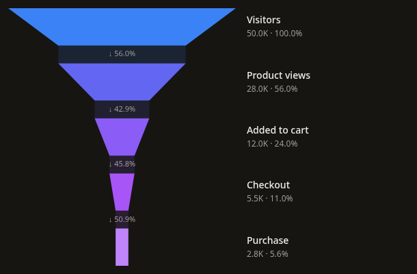
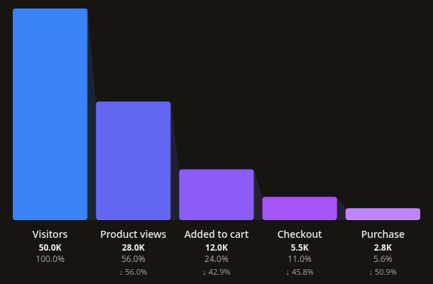
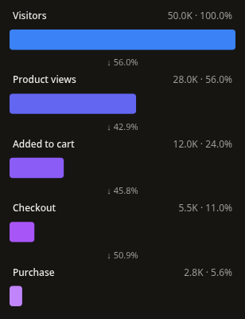
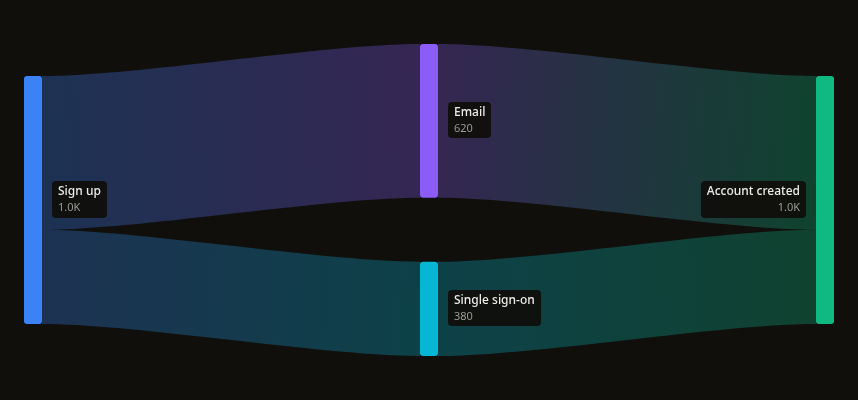
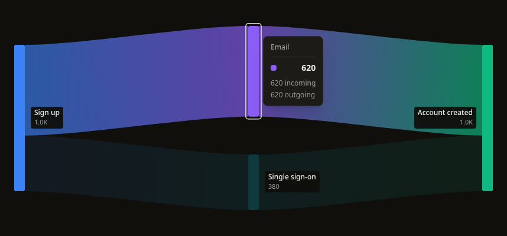
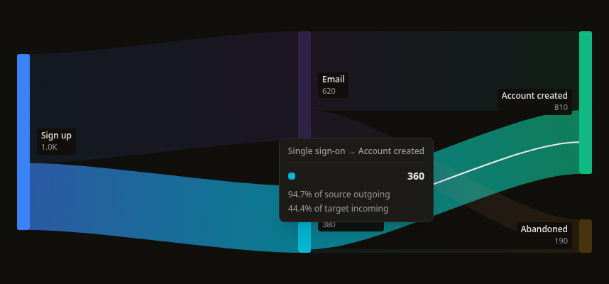
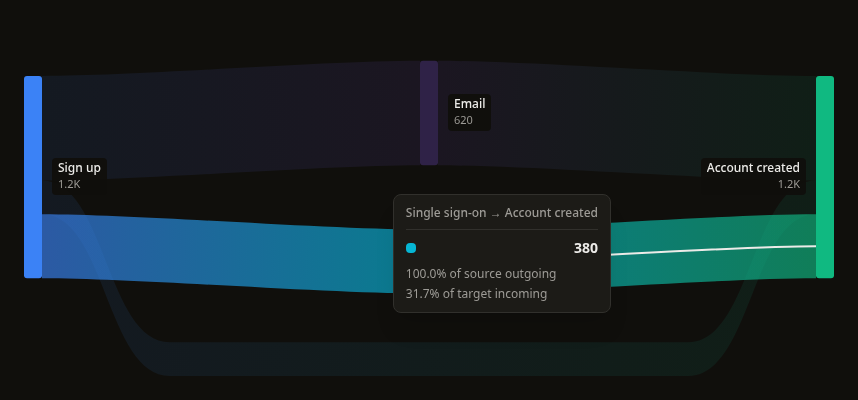
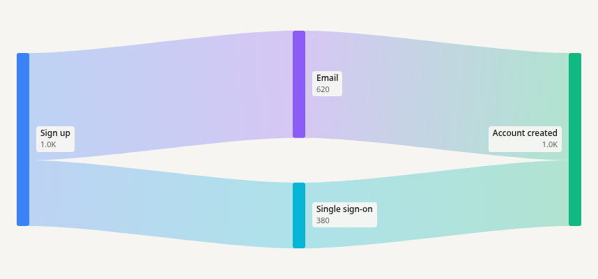
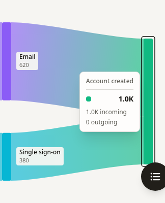

# FunnelChart and SankeyChart v1

Implemented September 13, 2026, after the approved Heatmap commit `dab0ac5`.
The user requested a funnel that splits into alternative paths and converges,
then chose to add that behavior as a separate **SankeyChart**. The registry now
contains twelve charts. TreeMapChart and WaterfallChart remain for later passes.

## References and decisions

[PostHog User paths](https://posthog.com/docs/product-analytics/paths) is the closest
reference to the requested branching view. It documents connected-path highlighting
and distinguishes path exploration from funnel conversion. Our chart accepts
aggregated transitions; it does not reproduce PostHog's query engine, session rules,
user deduplication, or conversion attribution.

[PostHog Funnels](https://posthog.com/docs/product-analytics/funnels) distinguishes
conversion relative to the first step from conversion relative to the previous step.
Combining events with OR creates one funnel step; it does not supply the separate
transition volumes necessary to draw branch widths.

[amCharts Funnel Series](https://www.amcharts.com/docs/v5/charts/percent-charts/sliced-chart/funnel-series/)
provides useful precedents for rectangular versus tapered slices, separate connectors,
and label placement. [Highcharts Funnel](https://www.highcharts.com/demo/highcharts/funnel)
provides another conventional taper reference. Labels in this implementation stay
outside small slices so they remain readable when conversion is low.

[d3-sankey](https://github.com/d3/d3-sankey) describes a directed acyclic network and
volume-proportional link widths. This implementation owns its small layout and
validation helpers; no d3 dependency was added. It preserves input order within
columns rather than offering arbitrary node dragging or iterative crossing minimization.

## Funnel corrections

The former component imposed a 15% minimum width on small/zero values, drew equal
widths in the straight variant, normalized geometry against the first stage, and
substituted 100% for undefined previous-stage rates. Some conversion annotations
appeared below the wrong stage. Its early state returns replaced the measured root.

The refactor separates value parsing and conversion from geometry and interaction:

- Five layouts: tapered, straight, smooth, horizontal, and columns. Straight and
  horizontal encode count by width; columns use height. Tapered/smooth enter at the
  current stage width and transition to the next width. Their area is not a count.
- The largest stage defines the visual maximum. Counts remain in supplied order;
  genuine increases stay visible. Zero has no painted area and stays inspectable.
- Percentages use the first count, conversion rates the preceding count. Zero or
  numerically unrepresentable denominators/results return null, displayed as a dash.
  Signed changes distinguish lost volume from gained volume.
- Numeric strings are supported. Missing, malformed, negative and nonfinite counts
  produce actionable row/key errors instead of silently becoming zero.
- Connectors, stage gap, rectangle corner radius, conversion and drop-off labels,
  palette, formatter, accessible name and description are configurable.
- Native SVG transforms grow shapes along their measured axis at fixed origins.
  Hover and resizing do not replay entrance. Labels remain stationary. Reduced
  motion and keyboard focus complete the animation immediately.
- All states preserve the measured frame. Refreshing retains known geometry;
  initial loading uses a shape-matched skeleton. Crowded layouts scroll internally.

Custom tooltip migration: `percentage` and `conversionRate` are now nullable.
`rawValue` preserves the original input, including a numeric string; `value` is the
parsed number. `data`, `index`, `formattedValue`, `previousValue`, and signed `change`
provide the original observation and the relevant comparison context.

## Sankey contract

`nodes` have a unique string `id`, a `label`, and an optional CSS `color`. `links`
have `source`, `target`, and finite nonnegative numeric `value`. Both preserve extra
fields, original object identity, and input indices in callbacks and custom inspection.

Every ribbon uses the same pixels-per-volume scale. A node's height represents
`max(incoming, outgoing)`, with both totals exposed separately. The chart does not
invent abandonment or equate aggregated volume with unique users. Explicit measured
abandonment connections are demonstrated in the playground.

A topological pass assigns columns. Sinks can align to the last column (`justify`)
or stay at their earliest depth (`start`). Longer connections route below intervening
nodes. Zero-valued links remain in topology and keyboard inspection but paint no area.
Empty, disconnected, repeated-label and isolated-node graphs remain valid. Duplicate
IDs, dangling endpoints, cycles/self-links, malformed volumes and overflowing node
totals fail with actionable errors. Return visits require distinct occurrence IDs.

Gradient ribbons follow endpoint colors; solid source/target coloring and curve
tension are optional. Node width and gap are configurable. Dense graphs reserve
label space and scroll instead of inflating small values or overlapping labels.

Inspection highlights reachable incoming/outgoing paths. Selecting a branch does not
highlight its unrelated sibling. This indicates connectivity, not an inferred
individual journey through a merge. Nodes and connections share a roving tab stop;
arrow keys inspect, Home/End jump, Escape dismisses, and Enter/Space activate.
Transparent hit paths expand small observations without widening painted ribbons.
Tooltips stay within the visible frame; labels have their own background for legibility.

The entrance reveals flow from left to right with an SVG clip; opacity remains
constant throughout. Labels stay readable. Reduced motion/focus finish immediately.
Known geometry persists during refresh; the initial skeleton itself branches and rejoins.

## Distribution and validation

Updated the manifest, desktop/mobile navigation, component exports, README, CLI
catalog, agent chart-selection table, documentation pages, and Storybook stories.
Generated artifacts were rebuilt through `npm run build:registry` (40 artifacts).
The Funnel helpers and all three Sankey helper/type files are included in both CLI
and shadcn output.

- **915 tests in 69 suites pass**, including 62 Funnel/Sankey interaction and model/
  geometry cases. Registry and agent-routing tests cover the new twelfth chart.
- Scoped ESLint and strict TypeScript pass. Global ESLint still has **27 errors and
  23 warnings** in existing unrelated code, down from the prior 30/24 baseline.
- Production Next.js/CLI build and Storybook build pass.
- Compiled CLI smoke installs **46 files**, with all expected dependencies and no
  unresolved monorepo-relative imports.
- A clean **React 18** consumer installs both charts through the actual compiled CLI
  and passes strict TypeScript. It checks inferred node/link/stage metadata, nullable
  inspection rates, and rejection of invalid keys, volume types, and color modes.
- Production Chromium QA covers all five funnel layouts at desktop/mobile widths,
  all exposed fixture/state transitions, explicit abandonment/direct connections,
  actual pointer hit testing on every sample ribbon, keyboard navigation and internal
  scrolling, zero values, and invalid inputs. No page or console errors were observed.
- Native mobile touch activates both charts and keeps measured tooltips within their
  frames. Document width does not overflow at 390px.
- Real motion sampling captured **61 Sankey frames** with advancing clip width and
  constant opacity, plus **44 distinct Funnel growth transforms** during entrance.
- `npm run dev:cli` remains blocked by the existing Node 26/tsx dependency failure:
  `unicorn-magic ERR_PACKAGE_PATH_NOT_EXPORTED`. The compiled CLI and clean consumer
  both pass; the watcher process was stopped after recording the error.

Screenshots under `assets/flow-v1/` were captured from the final production build.
The application was left running on port 3100 and opened on `/docs/components/sankey-chart`.
The user's pre-existing `package-lock.json` change is preserved separately.
