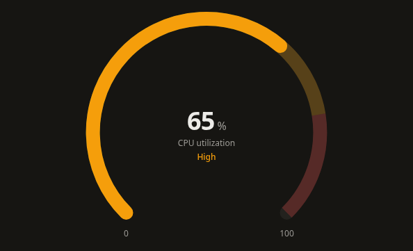
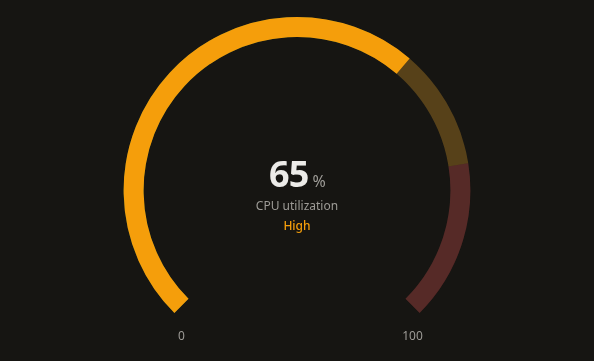
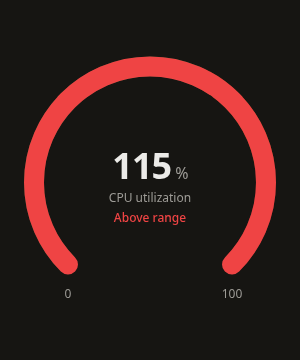
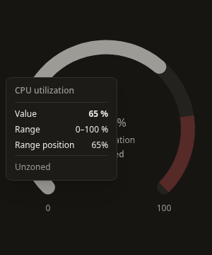
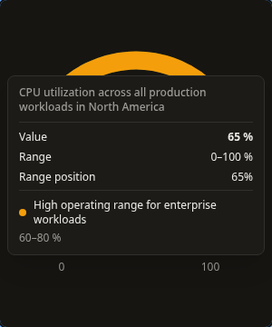
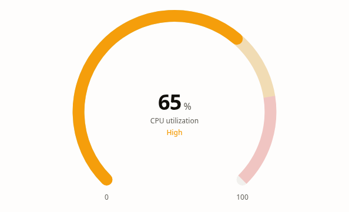

# GaugeChart v1: range truth, zones, and live arc updates

This follows the approved StackedBarChart work committed as `6cd97a8`. GaugeChart retains its 270-degree arc, required zone configuration, and scalar-value API. The registry description now accurately describes an arc instead of advertising a nonexistent needle.

## Behavior

- The center and inspection retain the actual finite measurement. Values above/below the configured range saturate the arc at the corresponding endpoint and display an explicit range status. The previous implementation replaced the measurement with its clamped value, hiding overruns. Range position is measured from `min`, so 70 within [20, 120] is 50% through the range.
- Bounds must be finite and increasing. Nonfinite measurements, invalid stroke/height options, and invalid zones produce actionable errors inside a persistent frame rather than throwing during render. Normalization handles signed finite extremes and narrow intervals around large offsets.
- Zones are sorted by bounds without mutating inputs. Each retains its original index; repeated colors cannot confuse tooltip identity. Zones must have finite increasing bounds inside the gauge range and may not overlap. Gaps remain unclassified and use neutral progress paint with an explicit “Unzoned” status.
- Zone starts are inclusive and ends exclusive, except at the gauge maximum. A shared boundary belongs to the zone starting there. A measurement outside the configured range has no active zone, even though its arc reaches a boundary. The arc and range-status label retain the color of the zone touching that endpoint; if the endpoint is unzoned, they remain neutral. The tooltip still reports no active zone for the actual outside-range measurement.
- The background and zones remain stationary. A native SVG path sweeps from the minimum over 800ms on entrance, then retargets from its current animated position over 450ms when the measurement changes. A Motion value updates the path without React renders per animation frame. There is no entrance fade. Focus completes animation immediately; focused updates, reduced motion, and `animation={false}` show the final arc directly. Hover and resize do not replay entrance.
- At the minimum, progress has no painted path or round-cap dot. At the maximum, its path exactly matches the full track. Full-circle utility paths use two arcs; gauge/zone paths no longer rely on epsilon offsets.
- `strokeLinecap` selects rounded or flat progress/track ends. Zone boundaries remain flat to avoid overlapping adjacent regions. Stroke thickness is capped for narrow frames, and endpoint labels and center content use bounded boxes. Long visible labels truncate; their full text remains available in inspection and accessible value text.
- The measured outer frame remains mounted through loading, empty, error, and ready states. Retaining the measurement and zones during loading preserves the exact track, zone, and target-progress geometry. Initial loading with unavailable/invalid data uses a neutral placeholder. Empty zone configuration retains the existing No Data behavior.
- The visualization is a focusable, read-only ARIA meter; its name defaults to the descriptive label when present. `aria-valuenow` is bounded to satisfy meter semantics; `aria-valuetext` announces the actual measurement, complete range, and classification/range status. Arrow keys do not modify the value. Focus, hover, and touch open the default or custom measured tooltip. Escape dismisses it; Enter/Space reopens inspection. Focus is preserved when value or zone objects update.
- Default inspection includes the actual measurement, range, bounded range-position percentage, and exact active-zone bounds/label. It works without supplying a custom renderer. Tooltip placement stays inside the chart frame in desktop and mobile layouts.

## API and migration

Additive props are `strokeLinecap` (default `"round"`), `valueFormatter`, `axisValueFormatter`, `ariaLabel`, and `description`. `unit` is appended separately from formatted values; use a formatter that does not duplicate it. The requested `strokeWidth` remains 20px by default and must be positive.

`GaugeChartTooltipData.value` now means the actual input measurement. Consumers that need the old bounded value should use the new required `clampedValue` field. `rangeStatus` is also required and is `"below"`, `"within"`, or `"above"`. Existing `percentage` remains the bounded position within [min, max]. Active-zone metadata includes its original optional `index`; consumers constructing typed payload fixtures must provide the new required fields.

Correct overlapping/outside/malformed zone definitions before rendering. Gaps no longer inherit the last zone's classification, and shared boundaries have a deterministic half-open contract. Values outside the range remain visible rather than silently appearing at min/max. Custom formatters never receive malformed measurement or bound values from validation states.

The documentation playground and Storybook cover live updates, range limits, signed/nonzero minima, empty/loading/error states, gaps, shared boundaries, repeated colors, unordered zones, invalid configurations, long labels, stroke sizes, end caps, and custom inspection. The sales dashboard's existing GaugeChart integration continues to render.

## Verification

Validated September 13, 2026:

| Check | Result |
| --- | --- |
| GaugeChart Jest | 2 suites, 71 tests passed across component, model, normalization, arcs, and layout |
| Full Jest suite | 65 suites, 807 tests passed |
| TypeScript | `npm run typecheck` passed |
| Scoped ESLint | Gauge source/tests/stories, documentation, and manifest have no errors or warnings |
| Global ESLint | Existing 30 errors remain; 25 warnings |
| Production build | `npm run build` passed, including registry and CLI builds |
| Storybook | `npm run build-storybook` passed |
| Registry | 38 generated artifacts, 11 published charts, current after regeneration |
| CLI smoke | 36 files installed with no unresolved imports or missing packages |
| Clean consumer | CLI installation into React 18 passed strict TypeScript, exact optional properties, unchecked index access, zone/tooltip metadata typing, and invalid value/zone/cap rejection |
| Chromium | 1440px and 390px: both end caps, retained loading geometry, state recovery, min/max, actual outside values, gaps/shared boundaries, repeated/unordered zones, signed/nonzero ranges, meter keyboard inspection, hover/touch, bounded tooltip/labels/stroke, invalid configurations, and light theme |
| Animation | 165 real-motion frames confirmed entrance sweep and forward/backward updates from the current arc, fixed track/zones, constant opacity, focus completion, and disabled/reduced motion |
| Integration | Existing sales dashboard GaugeChart renders in the browser |

Browser checks ran against development and production builds with no uncaught page errors. The previously identified development hydration warning and CLI source-watcher issue remain outside this change; compiled CLI installation passed. The pre-existing `package-lock.json` modification remains untouched. This pass does not claim screen-reader certification.

Boundary-color follow-up: 71 Gauge tests, scoped ESLint, the production build/type validation, and Chromium checks at 1440px and 390px passed. Above-range paint retains the upper boundary color (red in the CPU example), below-range status retains the lower boundary color, and internal gaps remain neutral. Actual measurements stay unchanged.

## Screenshots

