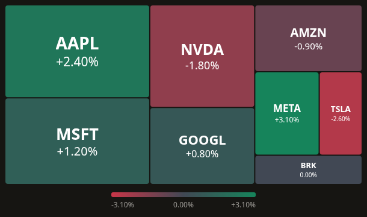
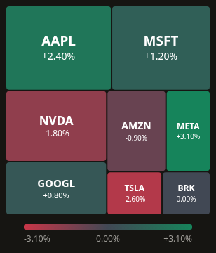
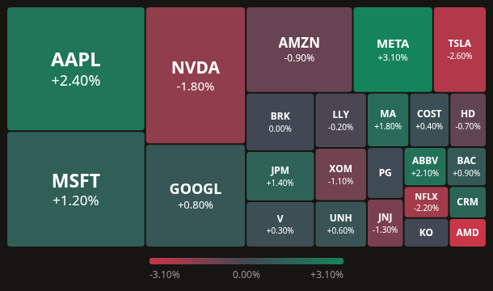
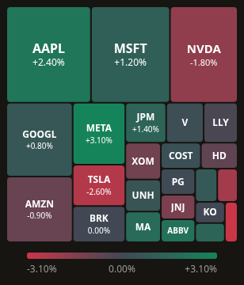
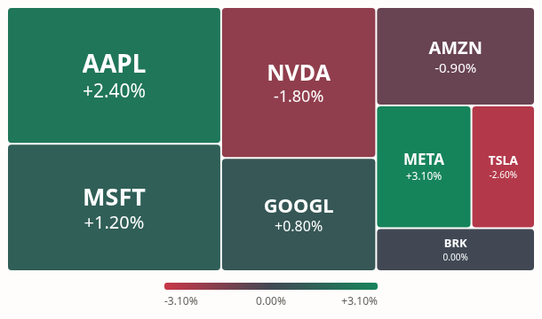
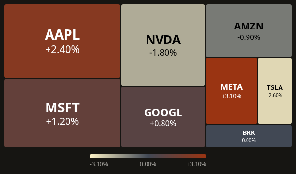

# Heatmap stock v2: readable market-map hierarchy

The first Heatmap refactor improved data correctness and inspection, but its stock labels became small black badges. The review identified weak text hierarchy, a nearly white neutral color, premature removal of mobile percentages, and layout optimized in a square before being stretched to the displayed aspect ratio.

The approved direction drew on [TradingView's stock heatmap](https://www.tradingview.com/heatmap/stock/) and the [Highcharts reference implementation](https://github.com/highcharts/highcharts/blob/master/samples/highcharts/demo/treemap-large-dataset/demo.js): direct labels, type that responds to available area, a visible neutral color, and allocation in the actual chart frame. Sector grouping and a trading terminal UI are outside this pass.

## Changes

- Tickers and percentages sit directly on each cell. Font sizes grow with area, capped at 30px for tickers, and are fitted using the installed font's measured metrics. Both lines shrink before the percentage is omitted. Long names can truncate; measured values are never shown as misleading partial percentages. Full values remain available through inspection and the source table.
- The eight-asset example shows all eight percentages at 390px. AAPL uses 28px ticker text at the tested desktop size and 19px on mobile, instead of the previous uniform 12px. A separate 24-asset playground dataset and dense/narrow Storybook cases exercise smaller cells without changing the default demo's observations.
- Stock has its own red/slate/green palette: `#c93648`, `#414854`, `#16845b`. Zero is a neutral slate cell, distinct from the hatch for missing data. The grid and radial palettes retain their existing behavior. Continuous scale semantics, custom domains, endpoint overrides and the legend remain aligned.
- Label ink is black or white according to luminance of browser-resolved cell paint. A one-pixel canvas resolves CSS variables, rgb/oklch and alpha; transparent colors are composited over ancestor surfaces. Inherited style/theme changes and font loading update the result. Color transitions are disabled on the label itself so the site's global transition cannot leave its contrast calculation based on an obsolete color. Surface-transition completion updates alpha compositing.
- Squarified allocation now receives the actual plot width and height. Resizing recalculates the layout rather than stretching square coordinates. Allocation still preserves weight proportions before gutters; explicit zero weights retain no area. Notice space is reserved before final allocation when any item has no visible area.
- Cell paths, label positions, inspection targets and anchors use the same final layout. Existing growth animation, keyboard navigation, touch persistence, loading geometry and original-row callbacks remain intact.
- `stock-label.tsx` is a published sibling. The registry and CLI fallback include its rewritten imports, and the CLI smoke test checks its installed path. No public prop or dependency was added.

## Validation

September 13, 2026:

- Heatmap: 65 tests passed; full repository: 66 suites, 861 tests passed.
- TypeScript, scoped ESLint, production build and Storybook build passed.
- CLI smoke: 40 files installed without missing files, unresolved imports or missing packages. Clean React 18 consumer passed strict TypeScript, exact optional properties and unchecked index access.
- Chromium: desktop and mobile, dark/light themes, 8/24 assets, zero and missing data, custom CSS colors, measured label fitting, retained loading paths, keyboard and touch inspection.
- Tested label contrast minima: default 4.68:1, CSS-variable preset 4.84:1, RGB preset 4.61:1. These are measurements of the tested opaque paints, not a certification of arbitrary user-supplied visual backgrounds.
- Actual CSS-variable changes recompute ink. Default mobile keeps eight percentages with no text or page overflow. Production browser checks report no uncaught errors.
- The earlier global lint baseline and the pre-existing `package-lock.json` change remain outside this pass.

## Rendered result

