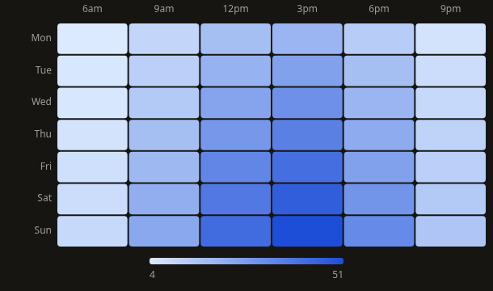
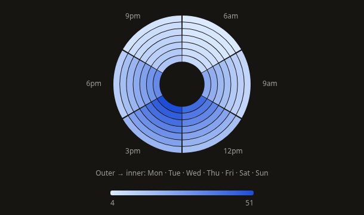
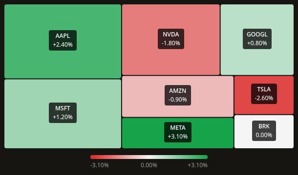
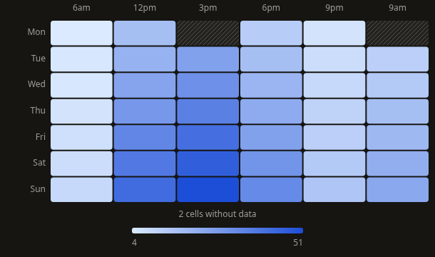
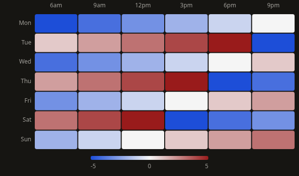
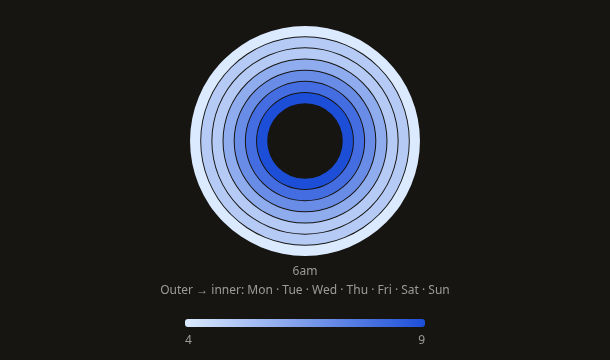
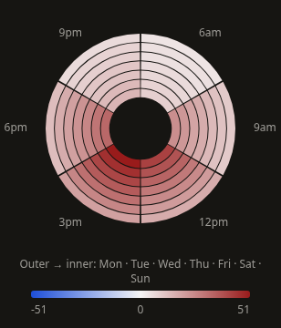

# Heatmap v1: missing observations, color scales and inspection

This follows the approved GaugeChart work committed as `420c6e7`. The grid, radial and stock variants remain available. Model validation, color normalization and geometry now live in three small published helpers; all variants share the same rendering and inspection contract.

The subsequent [stock v2 correction](heatmap-stock-v2.md) supersedes the initial stock badge styling and square-based layout described below, with updated screenshots and validation.

## Behavior

- Grid/radial categories retain first appearance. Each original x/y pair appears once; duplicates produce an actionable error identifying both rows. Missing combinations are explicit cells with no original row, rather than synthetic zero observations. Null, undefined and blank measurements are missing; finite numeric strings are parsed. Malformed/nonfinite measurements are rejected. The expanded matrix is capped at 10,000 cells, including missing combinations, before allocating a large sparse Cartesian product. This is a safeguard, not a performance guarantee.
- Zero retains its measured color. Missing cells use a hatch and “No data” inspection. Original row identity and index survive matrix ordering and stock layout. Absent combinations cannot trigger a callback. Existing rows with missing measurements remain selectable.
- Sequential scales use the observed range. Constant sequential data uses one middle color and a single legend value. Diverging and stock scales center on `midpoint`, zero by default, and automatically extend equally on each side when representable. Extreme finite bounds avoid overflow. A fixed `domain` must contain every measured value and, for diverging colors, extend below and above the midpoint. Invalid configuration produces an error instead of silently clipping measurements.
- Cells, tooltip metadata and legends share the same scale. Diverging legends place the neutral value at the center, including asymmetric fixed domains. Gradient and hatch IDs are unique per chart instance. CSS-native sRGB interpolation preserves named colors, rgb/oklch and inherited variables; consumers must supply valid CSS colors. Hover/focus adds an outline without changing the measured colors or dimming unrelated cells.
- Radial columns run clockwise from the top; rows run from outer to inner rings. Native SVG hit targets use the actual rendered sectors, eliminating the previous reversed-ring hover calculation. A single-column dataset renders complete annuli through two arcs per edge. Mobile side labels reserve space outside the rings; full row order appears beneath the chart.
- Stock area weights are finite and nonnegative. Omitted `weight` means equal allocation, independent of measurement sign. Explicit zero weights have zero area; an all-zero set displays “No positive area weights.” Iterative squarified allocation preserves proportions before the adaptive gutters, with no forced pixel minimum. Tiny allocations may become unrenderable at floating-point precision and are reported as having no visible area. All original observations remain in the accessible source table.
- Stock defaults to red/neutral/green color and signed percentages. Positive/negative values control color, independently of area. Label badges provide readable text on pale and saturated cells. Small cells omit visible labels while retaining inspection; `cellRadius` controls grid/stock corners and is bounded by cell dimensions.
- Cells grow from their own fixed anchors over 600ms. A shared Motion value updates native SVG transforms without React renders per animation frame. Paint and paths stay constant; there is no entrance fade or hover replay. Focus finishes motion immediately; disabled/reduced motion shows final geometry directly.
- Loading retains exact cell geometry when observations remain available. Initial loading uses a neutral placeholder matching the selected variant. Ready, empty, error and loading states share a persistent measured frame; height includes the legend and notices. Loading disables inspection and source actions.
- Every variant has one roving tab stop. Grid/radial arrow keys change row/column; stock arrows choose the nearest cell in that direction. Home/End jump to the first/last rendered cell, Escape dismisses inspection, and Enter/Space activate original observations when a callback exists. Pointer hover, touch and focus use the same tooltip. Touch inspection persists when contact leaves the screen; mouse exit restores focused inspection or dismisses it. The source table includes missing and zero-area observations.

## API and migration

Additive props are `domain`, `midpoint`, `valueFormatter`, `weightFormatter`, `ariaLabel` and `description`. Existing `data`, `x`, `y`, `value`, `weight`, variants, palettes, labels, legend, radius, sizing, state, animation and callback props remain. Stock continues to ignore `y` and supplies an empty `rowLabel` to callbacks.

`HeatmapChartTooltipData<T>` now contains original `data: T | null` and `index: number | null`. Both are null for absent matrix combinations. `value` and `normalizedValue` are nullable for missing measurements; `normalizedValue` uses the actual color scale in every variant, including stock. Handle null explicitly in existing custom renderers. Stock `weightValue` is the area weight, including the default equal weight of 1.

Consumers relying on implicit zero filling must supply real zero observations. Aggregate duplicate coordinates before passing grid/radial data. Consumers relying on stock's previous value-dependent default area must now specify `weight`. Do not expect all-zero weights to fall back to equal areas. Supply `valueFormatter` for stock metrics that are not percentages.

The playground, API reference and Storybook cover all variants, missing/zero/signed data, constant scales, fixed domains, custom CSS colors, a single radial column, repeated labels, zero area weights, long labels, radius, state transitions and invalid observations. Registry output includes all three helpers, and the CLI smoke test checks their installed paths. The existing analytics dashboard integration continues to render 63 cells.

## Verification

Validated September 13, 2026:

| Check | Result |
| --- | --- |
| Heatmap Jest | 2 suites, 59 tests passed |
| Full Jest | 66 suites, 855 tests passed |
| TypeScript | `npm run typecheck` and production type validation passed |
| Scoped ESLint | Heatmap source/tests/stories, docs and manifest: no errors or warnings |
| Global ESLint | Existing 30 errors and 24 warnings remain |
| Production build | `npm run build` passed, including registry and CLI |
| Storybook | `npm run build-storybook` passed |
| CLI smoke | 39 files installed with no unresolved imports or missing packages |
| Clean consumer | CLI install into React 18 passed strict TypeScript, exact optional properties, unchecked index access, nullable tooltip metadata, original row inference and invalid key/variant rejection |
| Chromium | Desktop 1440px and mobile 390px: all variants, native sector hit testing, keyboard/touch inspection, tooltip bounds, retained loading geometry, state recovery, CSS variables, missing cells, signed colors, single-column rings, zero weights and analytics integration |
| Motion | 144 real-motion frames: fixed anchors and paths, growth to final size, constant color/opacity, focus completion |

Screenshots and browser checks cover development and production builds. This pass does not claim screen-reader certification or large-dataset performance. The pre-existing `package-lock.json` modification remains untouched. The known CLI source-watcher issue is unchanged; the compiled CLI and a clean consumer both passed.

## Screenshots

