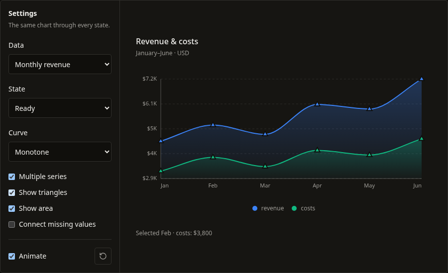
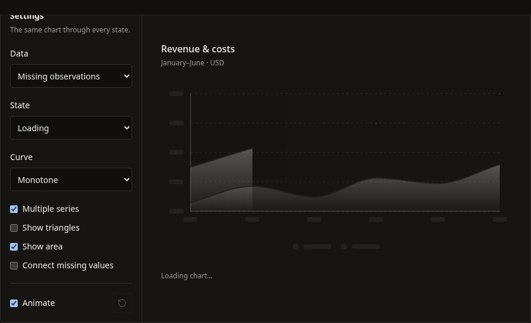
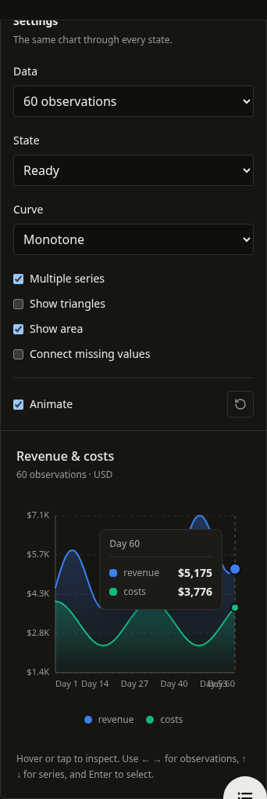

# LineChart v1: behavior and implementation changes

This completes the LineChart pass following [BarChart v1](bar-chart-v1.md). The other ten chart families remain pending in the original [quality plan](README.md).

## Behavior and architecture

- `utils.ts` separates numeric parsing, domains, scaling, contiguous segments, and interpolation from React rendering. Null and undefined values split lines and areas into real gaps; explicitly connecting them never invents a zero-valued observation.
- Linear, monotone, natural, and step curves have distinct implementations. Monotone interpolation avoids intermediate extrema. Natural cubic splines can overshoot; step transitions occur halfway between categories.
- Empty series retain their original palette and `showAreaForSeries` indices. Isolated observations remain visible even with `showDots={false}`. All-missing datasets render an empty state.
- The measured outer frame persists through loading, error, empty, and ready states. Refreshing retained data preserves line and area paths, axis placement, and legend space. Initial loading uses neutral placeholders without exposing fabricated observations to assistive technology.
- Category bands support hover, touch, and one roving Tab stop independently of visible markers. Left/Right and Home/End navigate observations; Up/Down select a series; Enter/Space activate a supplied callback; Escape dismisses the tooltip. Missing categories remain inspectable.
- Tooltips list available series together, retain parsed numeric and original values in custom payloads, and measure their content to stay within the frame. `valueFormatter`, `axisValueFormatter`, `ariaLabel`, and `description` provide additive customization.
- Instance-specific SVG IDs prevent gradient and clipping collisions. Lines, areas, and markers reveal together from the left. Loading and entrance effects respect reduced motion and `animation={false}`.
- The manifest distributes the new geometry and tooltip helpers through both registries. No runtime dependency was added.

## Compatibility and migration

Existing prop names, click callback arguments, and custom-tooltip payload structure remain available. Review these visible changes before updating copied components:

1. `connectNulls` now defaults to **false**, previously true. Set `connectNulls={true}` explicitly when bridging missing observations is intentional. The corrected implementation connects measured endpoints without inserting a value at the missing category.
2. Malformed, ambiguous, or nonfinite numeric values now produce an actionable error. Normalize strings such as `"12abc"`, `"1,5"`, and empty strings before rendering. Null and undefined are allowed gaps. Valid English-formatted strings such as `"$1,250"`, `"15%"` (15 percentage points), and scientific notation remain supported.
3. `height` includes legend space and applies to loading, error, empty, and ready states. Y-axis tick labels remain visible when grid lines are disabled.
4. Areas use gradient fills and close each contiguous segment at zero or the nearest domain edge. Triangular markers remain the default; singleton segments remain visible even when other markers are disabled.
5. `step` and `natural` now implement their advertised interpolation instead of falling back to straight lines. Natural splines may extend beyond the observed domain and are clipped to the plot with marker padding.

X values are equally spaced categories in input order, including date strings. There is no continuous time scale. Label shortening uses approximate text widths; large-data rendering and complete assistive-technology certification remain outside this pass.

## Review and validation

Use `/docs/components/line-chart` to compare datasets, curves, series, area fills, and states. `Charts/LineChart` in Storybook includes gaps, singletons, constant values, multiple instances, hidden markers, and state transitions.

Validation completed September 12, 2026:

| Check | Result |
| --- | --- |
| LineChart Jest tests | 2 suites, 41 tests passed |
| Full Jest suite | 64 suites, 592 tests passed |
| TypeScript | `npm run typecheck` passed |
| Production build | `npm run build` passed, including registry and compiled CLI |
| Storybook build | `npm run build-storybook` passed |
| CLI installation smoke test | Passed: 33 files, all expected helpers/dependencies present, no unresolved imports |
| Scoped ESLint | Changed chart, stories, docs page, and manifest passed; the CLI smoke script is ignored by repository ESLint configuration |
| Repository ESLint | 30 existing errors and 38 warnings outside this refactor |
| Chromium at 1440px and 390px | Gaps/bridging, all four curves, retained loading geometry, state recovery, keyboard activation/Escape, hover/touch inspection, tooltip bounds, and page overflow checks passed |
| Real browser motion | 50 animation frames confirmed a growing reveal with a fixed left origin; computed origin drift was 0.000px |
| CLI source watcher | Existing `unicorn-magic` resolution failure (`ERR_PACKAGE_PATH_NOT_EXPORTED`) reproduced on Node 26.7.0; compiled CLI and installation smoke test passed |

The browser interaction run produced no uncaught page errors. Jest's shared Motion mock forwards animation props to DOM elements and reports an `initial={false}` warning; this is a test-mock limitation, not a browser warning from LineChart. The workspace lockfile modification predates this continuation and was left untouched.

## Screenshots

