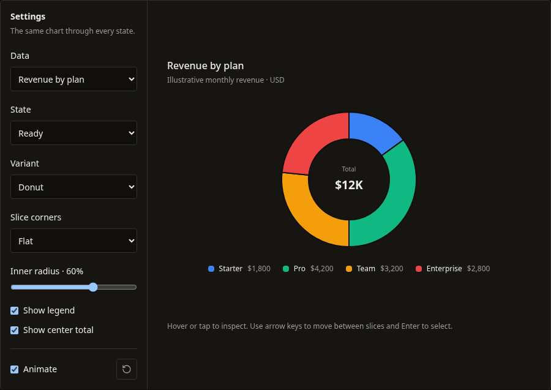
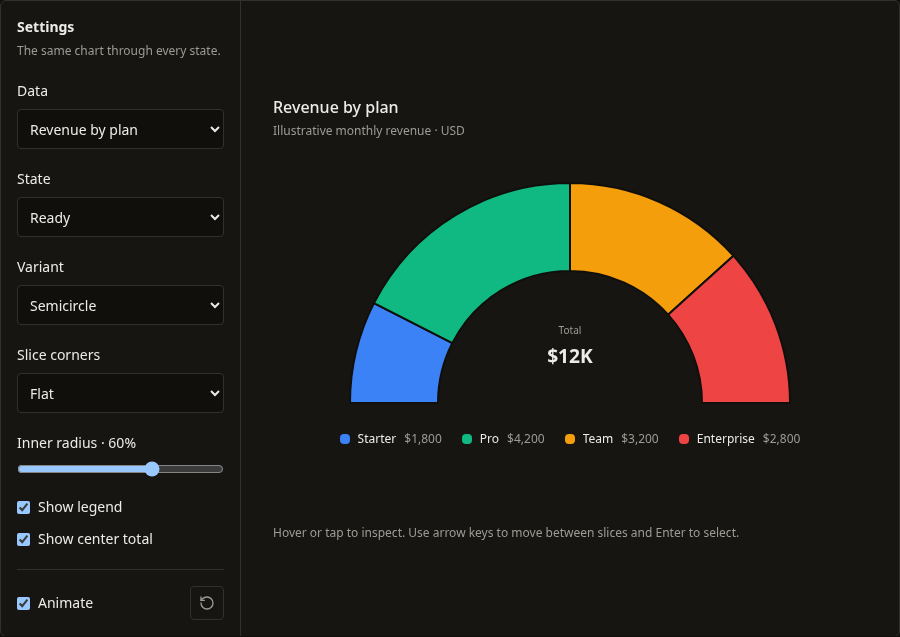
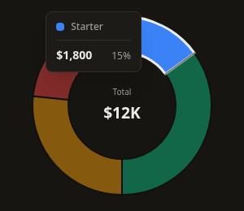
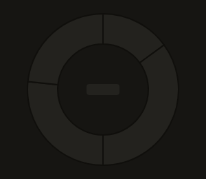
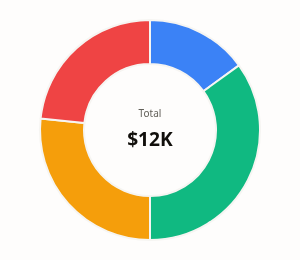
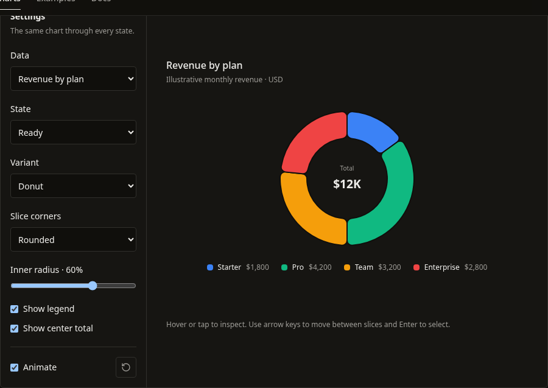
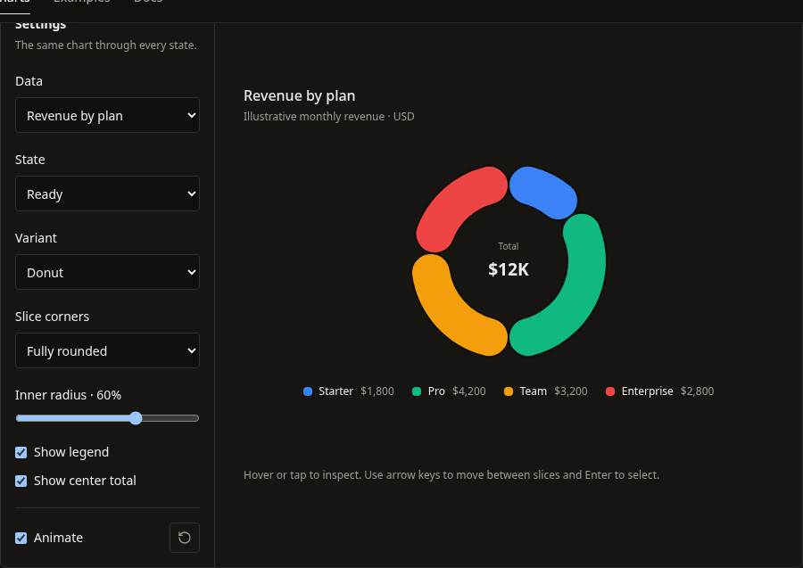
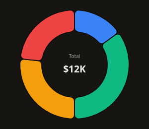

# PieChart v1: proportions, geometry, and inspection

This follows the removal of standalone AreaChart in commit `a57f02b`. The library now publishes 11 charts; ordinary area fills use `LineChart` with `showArea`.

## Behavior changes

- The measured frame persists through loading, error, empty, all-zero, and ready states. Every variant keeps the requested height, including an optional legend. The semicircle now fits and centers inside that frame instead of reducing the outer height.
- `utils.ts` owns validation, proportion calculations, radial layout, and SVG paths. Values must be finite and nonnegative; missing/malformed values no longer silently change the total. Numeric strings follow the same parsing contract as LineChart. Totals outside the finite numeric range produce a rescaling error.
- Zero observations have no angle, path, or focus target. Original row indices still determine colors and click payloads. The optional legend retains zero rows. An all-zero total displays a specific empty-state explanation.
- A full circle uses two exact arcs. Full donuts use separate, oppositely wound outer and inner contours, avoiding the radial seam caused by an epsilon cut or a connecting stroke. Full pies and donuts start at the top; semicircles start at the left and occupy the upper half.
- Donut and semicircle inner radii accept finite fractions from 0 inclusive to 1 exclusive. Invalid radii show an actionable error. Pie ignores the unused inner-radius prop. Center content fits inside the hole, with a separate rectangular layout for semicircles.
- Loading with retained data uses the exact same paths and dimensions as the ready chart. Initial loading uses four neutral slices and never announces fabricated observations. Center-content callbacks are not invoked with placeholder data.
- One slice enters the Tab order. Arrow keys wrap through positive slices; Home/End jump; Enter/Space invoke the original callback; Escape dismisses the tooltip. Focus has a visible outline. Small slices remain keyboard-inspectable. Non-actionable slices do not advertise button semantics.
- Hover and touch use a stable radial tooltip anchor. The shared inspection tooltip measures content and clamps placement within the chart. Data replacement and loading cycles clear stale inspection.
- Entrance reveals the slices clockwise over 850ms using one animated SVG clip path. Slice geometry and center content stay fixed; inspection never restarts the entrance. Keyboard focus completes the reveal immediately. Reduced motion and `animation={false}` show the complete chart immediately.
- `cornerRadius` controls slice corners in pixels: zero preserves flat edges, 8 rounds them, and larger values cap at the radius that fits each sector and ring thickness. Pie rounds its outer corners; donut and semicircle round both edges. Full circles remain seamless. Loading retains the same rounded paths.

## Compatibility and migration

Existing data keys, variants, callback arguments, colors, center-content payloads, and custom tooltip fields remain. Optional `cornerRadius`, `showLegend`, `valueFormatter`, `percentageFormatter`, `ariaLabel`, and `description` props are additive. The generic export preserves row inference in copied components.

Review these visible corrections when updating copied code:

1. `tooltipRenderer` receives the original value field in `rawValue`, rather than the category field. Use `label` for the category and `value` for the parsed number.
2. Null, undefined, malformed strings, missing category keys, invalid radii, and nonfinite totals produce errors. Normalize data explicitly instead of relying on silent zero coercion.
3. `height` now means total frame height for semicircles as well as full circles. Applications that compensated for the old shrinking semicircle frame can remove that compensation.
4. Full pies/donuts begin at the top. Zero rows no longer create degenerate radial paths or keyboard stops; callbacks for remaining rows retain their original indices.
5. Default percentage formatting uses at most one decimal, `<0.1%` for positive shares below that threshold, and `>99.9%` for nearly complete shares. This avoids reporting a positive share as zero or an incomplete share as 100%. Custom tooltip payloads retain the numeric percentage.

Legend space is capped and scrolls when necessary. Long labels shorten visually while retaining full names in accessible slice labels and legend titles. Consumers should keep custom center content compact. This pass does not claim screen-reader certification or large-category performance guarantees.

## Review and validation

Open `/docs/components/pie-chart` to compare variants, flat/rounded/fully rounded corners, inner radius, center total, legend, normal/single/zero/tiny/long/invalid data, initial loading, and refresh. Storybook mirrors these scenarios under `Charts/PieChart`.

Validation completed September 12, 2026:

| Check | Result |
| --- | --- |
| PieChart Jest tests | 2 suites, 65 tests passed |
| Full Jest suite | 64 suites, 624 tests passed |
| TypeScript | `npm run typecheck` passed |
| Scoped ESLint | Changed component, tests, stories, docs page, and manifest passed |
| Repository ESLint | Still fails on 30 pre-existing errors; 33 warnings |
| Production build | `npm run build` passed, including registry and CLI builds |
| Storybook | `npm run build-storybook` passed |
| Registry | 38 generated artifacts current; 11 published charts, with no AreaChart registry item |
| Compiled CLI smoke test | 35 files installed, including PieChart geometry helpers; no unresolved imports |
| Clean consumer | Compiled CLI installed PieChart into a temporary React 18 project; strict TypeScript, exact optional properties, unchecked index access, callback inference, tooltip/center payloads, and invalid-key rejection passed |
| Production Chromium | 1440px/390px: all variants, full circles, retained loading paths, state recovery, invalid/zero rows, keyboard navigation, touch/hover, tooltip bounds, long labels, light theme, and no page overflow passed |
| Real motion | 65 frames per variant confirmed a growing circular sweep, constant slice opacity and geometry, fixed center, immediate keyboard completion, and reduced-motion bypass |
| Rounded geometry | Flat, rounded, and fully rounded corners in all variants; mobile thin rings, tiny shares, and full circles stay within their radii (0.1px browser path-sampling tolerance) |
| Area retirement | Old HTML documentation redirects to LineChart; registry index contains 11 entries and excludes AreaChart |

No uncaught page errors occurred in the production browser run. Development retains the previously documented site hydration warning. The PieChart tests use a Motion stub that forwards SVG refs so navigation tests exercise actual DOM focus. The existing CLI source watcher issue is documented in the earlier reports; compiled CLI and clean-consumer checks passed. The pre-existing workspace lockfile modification remains untouched.

## Screenshots

