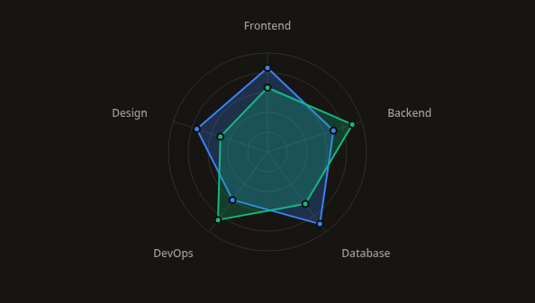
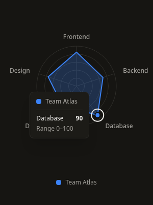
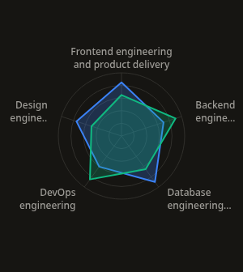
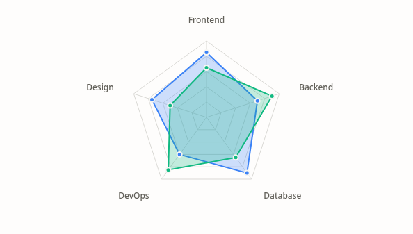

# RadarChart v1: scales, growth, and inspection

This follows the approved PieChart work committed as `9cd099b`. RadarChart retains the existing multi-series API and polygon/circular grid choices.

## Behavior

- The measured outer frame remains mounted through loading, empty, error, invalid-data, and ready states. `height` includes the optional wrapping legend. Retained-data loading reuses the exact paths, axis positions, and grid dimensions; initial loading uses a neutral placeholder with the configured axis count.
- Polygons and points grow together from a fixed center over 750ms. Grid lines and labels remain still. A single SVG transform updates through a Motion value subscription, avoiding React renders per animation frame and SVG bounding-box origin changes. Focus completes growth immediately; reduced motion and `animation={false}` show the complete shape. Inspection and layout changes do not restart entrance.
- Missing/malformed/nonfinite observations fail with the series, axis, and key involved. Zero is a measured observation, including when all vertices coincide at the center. Supported numeric strings use the same parser as LineChart and PieChart.
- Every axis must have a unique key, a label, and a finite increasing range. Every series must have a unique nonempty id. Explicit ranges must contain every observation; out-of-range values no longer silently clamp to an endpoint. Normalization handles signed finite extremes without overflowing the range subtraction.
- Automatic ranges include zero and the observed extrema, with a rounded/padded positive maximum. Negative-only dimensions end at zero. All-zero automatic dimensions use [0, 1]. Documentation demonstrates explicit [0, 100] ranges for comparable scores and explains the meaning of independent ranges and signed minima.
- One data point enters the Tab order. Left/Right changes axis; Up/Down changes series; Home/End jumps within a series; Enter/Space invokes the original series callback; Escape dismisses inspection. These controls work when dots are hidden and when all points overlap at zero.
- Axis callbacks have focusable labels/endpoints with Enter/Space activation. Legend buttons support inspection and optional selection. Original series and axis indices remain intact; drawing order is not changed on hover.
- Hover, touch, and focus use the same measured tooltip anchored to the actual point. Point inspection shows the value and axis range. Custom tooltips receive the original data plus point metadata with `type: "point"`; series inspection retains `type: "series"`.
- Long labels wrap into bounded boxes. Full names, formatted observations, and axis ranges remain available in the accessible data table. Theme colors use the existing CSS variables directly.

## API and migration

`showLegend`, `valueFormatter(value, axis)`, `ariaLabel`, and `description` are additive. The legend defaults to multiple-series charts, and its height is bounded within the frame.

`RadarAxis<T>` now constrains keys to the series data shape. Existing separately declared arrays whose keys widened to `string` should use `as const` or `satisfies readonly RadarAxis<Scores>[]`:

```tsx
type Scores = { speed: number; quality: number; reliability: number };
const axes = [
  { key: "speed", label: "Speed", min: 0, max: 100 },
  { key: "quality", label: "Quality", min: 0, max: 100 },
  { key: "reliability", label: "Reliability", min: 0, max: 100 },
] satisfies readonly RadarAxis<Scores>[];
```

Normalize incomplete records before rendering. If existing data relied on silent clamping, correct observations or adjust explicit bounds. A signed axis starts at its minimum, not necessarily zero; keep the range visible when interpreting distance from the center. Polygon area depends on axis order and ranges and should not be presented as an aggregate score.

`gridLevels` accepts integers from 1 through 20. Height must be positive; offsets and stroke widths must be nonnegative; fill opacity must be within [0, 1]. Invalid options show actionable errors inside the frame. Mobile layouts reduce label offsets to keep the labels in bounds.

## Verification

Validated September 12, 2026:

| Check | Result |
| --- | --- |
| Radar Jest coverage | 3 suites, 117 tests passed across component, geometry, and scales |
| Full Jest suite | 64 suites, 669 tests passed |
| TypeScript | `npm run typecheck` passed |
| Scoped ESLint | Radar source/tests/stories, documentation page, landing integration, and manifest passed |
| Global ESLint | Existing 30 errors remain; 32 warnings |
| Production build | `npm run build` passed, including registry and CLI builds |
| Storybook | `npm run build-storybook` passed |
| Registry | 38 generated artifacts, 11 published charts, current after regeneration |
| CLI smoke | 35 files installed; all Radar siblings present and no unresolved imports |
| Clean consumer | CLI installation into React 18 passed strict TypeScript, exact optional properties, unchecked index access, generic axis/callback/tooltip inference, and unknown-key rejection |
| Production Chromium | 1440px and 390px: both grids, retained loading paths, state recovery, hidden-dot keyboard navigation, series/axis actions, touch/hover, tooltip bounds, automatic and signed scales, zero/invalid inputs, long labels, and light theme passed |
| Animation | 65 real-motion frames confirmed growth around the fixed center, static grid, constant opacity, focus interruption, and disabled/reduced-motion final geometry |

No uncaught page errors occurred during production verification. The pre-existing development hydration warning and CLI source-watcher issue are unchanged; compiled CLI installation passed. No screen-reader certification or large-series performance claim is made. The pre-existing `package-lock.json` modification remains untouched.

## Screenshots










