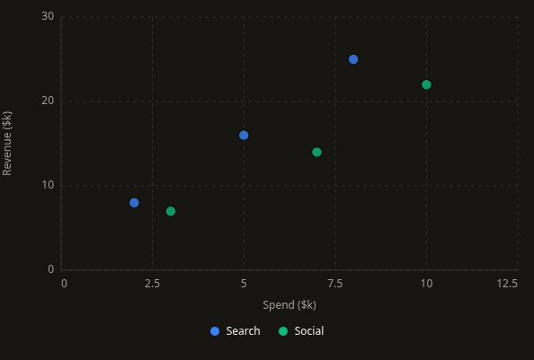
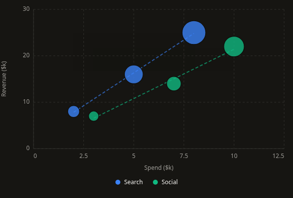
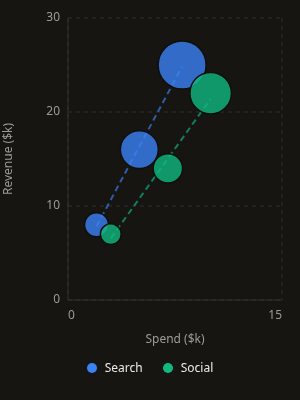
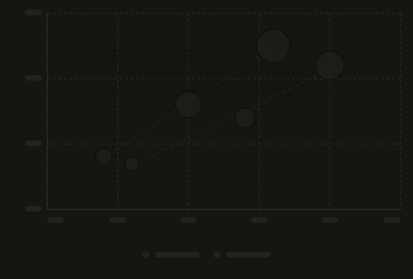
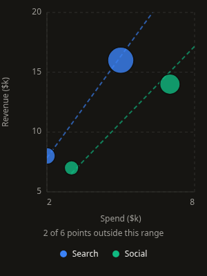
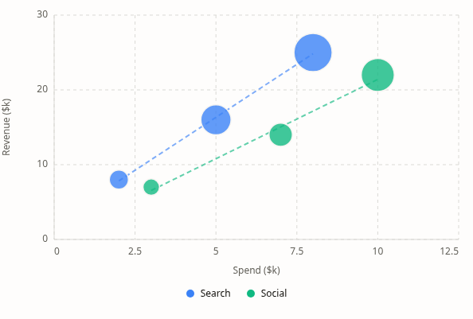

# ScatterPlot v1: bubbles, viewports, and inspection

This follows the approved RadarChart work committed as `d453cd5`. ScatterPlot keeps the flat observation API and multi-series support, with explicit bubble-size semantics and a persistent measured frame.

## Behavior

- `height` includes the optional legend and viewport notice in every state. Retaining observations during loading preserves the exact point positions, bubble radii, grid, and trend geometry. Initial loading uses a neutral placeholder. Empty, error, and loading states recover without a consumer remount.
- Points grow at their final coordinates over 650ms. One Motion value updates native circle radii without React renders per animation frame. Grid and trends stay still; ready marks do not fade. Focus finishes entrance immediately. Reduced motion and `animation={false}` render complete circles, and inspection/resize do not restart growth.
- Coordinates use the shared strict numeric parser. Missing, malformed, or nonfinite X/Y values report the row and key instead of silently dropping observations. Signed coordinates and numeric strings are supported. Missing configured labels/series and invalid bubble values produce actionable errors.
- Automatic domains pad for marker radius and use finite rounded bounds. Constant, tiny, large-offset, and signed extreme domains remain representable. Tick generation has bounded iteration and retains ticks inside the displayed domain.
- `xDomain` and `yDomain` are exact viewports. Points whose centers lie outside either domain have no mark or keyboard stop; a visible count identifies the excluded observations. Source rows and original callback indices remain intact, and an accessible table includes observations outside the view. Point paint, hit regions, and trends are clipped to the plot rectangle. A valid viewport containing no points displays an explicit empty-range message while retaining axes.
- Bubble values default to an area scale: radius is `max(minRadius, maxRadius * sqrt(value / maxValue))` for positive values. The minimum radius is a visibility floor, so values below that threshold are not strictly area-proportional. Zero has zero painted radius and remains inspectable through its keyboard/pointer target. Four times the value produces twice the radius above the visibility floor. Large bubbles paint first so smaller bubbles remain visible; hovering does not change a data radius.
- Per-series least-squares trends use all validated observations, including those outside the viewport. Fits are centered and normalized before covariance calculations to reduce cancellation around large offsets. Lines are limited to observed X values and clipped against both viewport axes. Fewer than two observations, no X variation, or unrepresentable coefficients omit a trend. Constant Y produces a horizontal fit with `r2: null`. A trend is descriptive and does not establish causation.
- One point enters the Tab order. Left/Right traverses X order, with Y and original index breaking ties; overlapping and zero-size observations remain reachable. Up/Down switches to the nearest-X point in the next/previous series, or traverses points when there is only one series. Home/End jumps to the first/last point in X order. Escape dismisses inspection; Enter/Space invokes an optional action with the original row/index. Points advertise a button role only when an action exists.
- Hover, touch, and focus share a tooltip anchored to the actual coordinate. Long names wrap within the measured frame. Formatting applies to axes, inspection, accessible names, and the source table. Series colors retain first-appearance order after clipping.

## API and migration

New optional props are `label`, `sizeScale`, `sizeLabel`, `sizeFormatter`, `ariaLabel`, and `description`. Generic inference now survives the memoized export, including original-row callbacks and tooltips.

`size` accepts a fixed pixel radius or a data key. The default keyed-bubble mapping changed from linear radius to area. Set `sizeScale="radius"` to retain the previous linear observed-min/max mapping; equal positive values use the midpoint radius in that mode. Zero values have no painted area in either mode. `sizeRange` remains the minimum positive/maximum pixel radius and defaults to `[4, 40]`.

Normalize incomplete records before rendering instead of relying on silent filtering or a default radius for malformed size values. To show all observations, omit explicit domains or expand them; explicit bounds now clip the viewport rather than allowing marks to paint beyond the axes. Trend fitting continues to include all source observations when the viewport changes.

Custom `ScatterPlotTooltipData<T>` payloads now include required `data`, `index`, and `label` metadata alongside the existing numeric/formatted coordinates, size, series key, and color. Consumers constructing their own typed payload fixtures must provide these fields. Internal regression helpers return `null` when a fit is unidentified, and `r2` is nullable for constant Y.

The authored playground documents all props and demonstrates scatter/bubble modes, both size scales, retained/initial loading, clipping, overlapping points, single/constant coordinates, zero/equal sizes, signed and malformed data, and long labels. Storybook mirrors these cases plus keyboard actions and state transitions. Registry artifacts derive from the updated source and manifest.

## Verification

Validated September 13, 2026:

| Check | Result |
| --- | --- |
| Scatter Jest coverage | 3 suites, 68 tests passed across component, scales/model, and regression |
| Full Jest suite | 64 suites, 712 tests passed |
| TypeScript | `npm run typecheck` passed |
| Scoped ESLint | Scatter source/tests/stories and documentation passed; shared tooltip types retain 5 pre-existing unused-generic warnings, no errors |
| Global ESLint | Existing 30 errors remain; 30 warnings |
| Production build | `npm run build` passed, including registry and CLI builds |
| Storybook | `npm run build-storybook` passed |
| Registry | 38 generated artifacts, 11 published charts, current after regeneration |
| CLI smoke | 35 files installed with no unresolved imports or missing packages |
| Clean consumer | CLI installation into React 18 passed strict TypeScript, exact optional properties, unchecked index access, callback/tooltip row inference, and unknown X/Y/size-key rejection |
| Chromium | 1440px and 390px: area/radius modes, retained loading geometry, state recovery, viewport clipping, keyboard navigation through overlaps, callbacks, zero bubbles, constant-coordinate trends, touch/hover, tooltip bounds, invalid/signed/long data, and light theme |
| Animation | 55 real-motion frames confirmed radius growth at fixed coordinates, static grid/trends, constant opacity, focus interruption, and disabled/reduced-motion final geometry |

The browser checks ran against both development and production builds without uncaught page errors. The previously identified CLI source-watcher issue remains outside this change; compiled CLI installation passed. The pre-existing `package-lock.json` modification remains untouched. This pass does not establish a large-dataset performance limit or screen-reader certification.

## Screenshots

