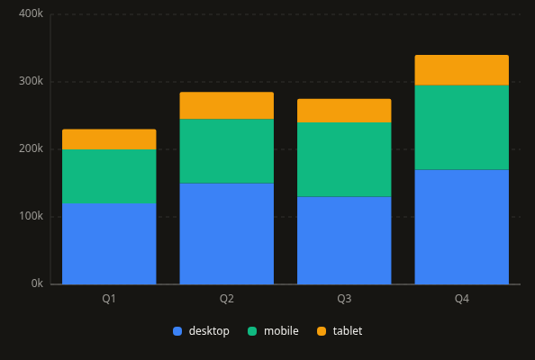
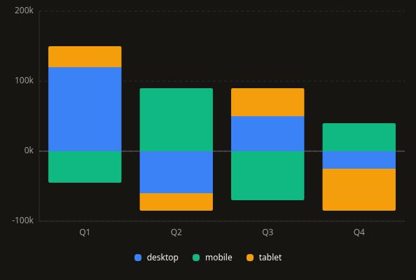
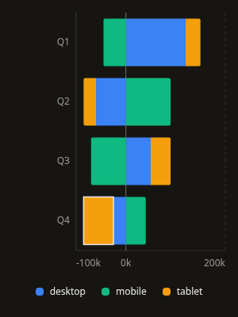
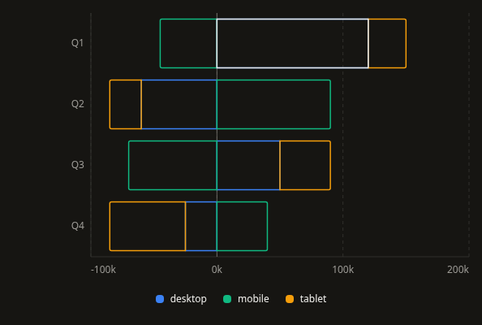
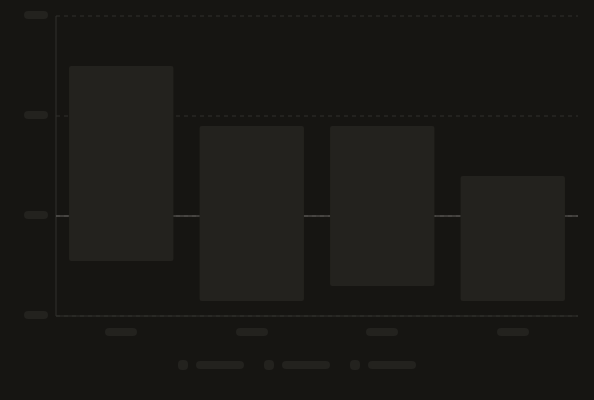
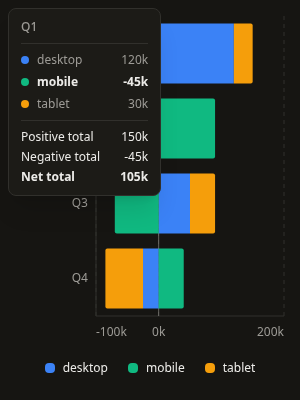
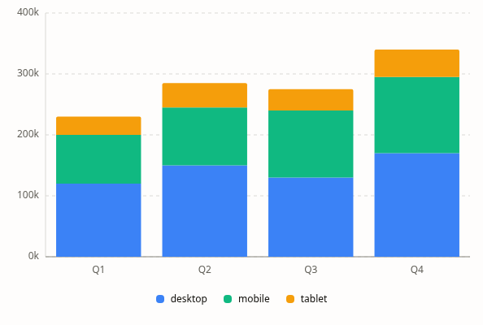

# StackedBarChart v1: signed stacks, growth, and segment inspection

This follows the approved ScatterPlot work committed as `10da83a`. The existing flat-row API, filled/outline variants, and vertical/horizontal orientations remain available.

## Behavior

- The model accumulates positive and negative contributions independently in value space. A single zero-inclusive domain contains every positive and negative stack total. The previous largest-absolute-total scaling and pixel clamping could truncate mixed-sign segments; the new geometry preserves both extents and their shared scale. A row containing +100 and −100 paints both contributions even though its net total is zero.
- Missing, malformed, or nonfinite values identify the row and numeric key instead of becoming zero. The shared strict parser accepts numbers and unambiguous numeric strings. Categories must be present, and `y` must contain at least one unique key. Positive/negative total overflow reports an actionable rescaling error. Duplicate category labels retain distinct rows and callback indices.
- Ticks and geometry use finite calculations for tiny values and signed numeric extremes. Zero remains in every domain. All-zero rows have no painted segment length but remain inspectable. No minimum visible length is added to the data marks.
- Segment starts and ends are computed before projection. Positive segments grow upward/rightward from zero, and negative segments downward/leftward. The whole drawing grows through a single native SVG transform over 700ms, preserving segment joins and proportions throughout entrance. A Motion value updates the transform without React renders per frame. Grid, zero baseline, and labels stay still; marks do not fade. Focus completes entrance immediately, and reduced/disabled motion renders final geometry. Inspection and resizing do not restart entrance.
- The measured frame remains mounted through loading, empty, error, and ready states. `height` includes the optional wrapping legend. Retaining rows while loading preserves exact paths, grid positions, baseline, and dimensions. Initial loading uses neutral placeholders. No keyboard targets remain active while loading.
- `cornerRadius` rounds only the terminal positive/negative segment's outside end, with the radius capped by its dimensions. Internal joins remain flush and the zero end stays square. Trailing zero segments do not remove rounding from the last nonzero segment. Filled and outline variants share the same geometry.
- One segment enters the Tab order. In vertical charts, Left/Right changes category and Up/Down changes segment in `y` order; horizontal charts swap those axes. Home/End jumps to the first/last segment across the chart. Enter/Space invokes an optional callback with the actual selected key and original row/index. Escape dismisses inspection. Zero segments remain reachable, including an entirely zero stack.
- Every segment has its own pointer/focus target in both variants. The old outline-wide hit region that selected the first segment is removed. Focus/hover highlights the inspected segment without changing its data geometry. The chart advertises button actions only when a callback exists.
- Hover, touch, and focus share a measured tooltip anchored to the selected segment. Inspection includes all row segments, emphasizes the active key, and labels positive, negative, and net totals for signed rows. Custom tooltips receive original-row and active-segment metadata. An accessible source table includes every observation and signed subtotal.
- Long categories truncate within bounded boxes. Dense category labels are thinned to avoid collisions; every original row remains reachable by keyboard and in the source table. Series colors remain tied to `y` order, including zero values. Existing theme variables work in both light and dark themes.

## API and migration

Additive props are `cornerRadius` (default 2px), `showGrid`, `gridStyle`, `valueFormatter`, `axisValueFormatter`, `ariaLabel`, and `description`. Use `cornerRadius={0}` for flat outer ends. Numeric tick formatting defaults to the detailed value formatter and can be overridden independently.

Normalize incomplete records before rendering instead of relying on silent zero substitution. Mixed-sign charts now use the full negative-to-positive domain, so corrected bar lengths and the zero baseline can differ substantially from the old rendering. Legend height is reserved inside `height`, matching the other refactored charts.

`StackedBarChartTooltipData<T>` retains `label`, `index`, `segments`, and `total`; `total` remains the signed net sum. It now includes required `data`, `activeKey`, `activeIndex`, `positiveTotal`, and `negativeTotal` fields. Consumers constructing their own typed tooltip fixtures must provide that metadata. Generic row inference survives the memoized export. Existing `StackSegment` and `ProcessedBar` type exports remain available.

The authored documentation playground and Storybook cover both orientations and variants, rounded/flat ends, positive/negative/cancelling/zero stacks, sparse segments, single/dense categories, long labels, malformed data, total overflow, loading, error, keyboard actions, and state transitions. The new model/geometry helper is registered as a copied sibling and included in CLI installation assertions.

## Verification

Validated September 13, 2026:

| Check | Result |
| --- | --- |
| StackedBarChart Jest | 2 suites, 54 tests passed across component, model, geometry, domains, and corner paths |
| Full Jest suite | 65 suites, 757 tests passed |
| TypeScript | `npm run typecheck` passed |
| Scoped ESLint | Stacked chart source/tests/stories, documentation, and manifest have no errors or warnings |
| Global ESLint | Existing 30 errors remain; 25 warnings |
| Production build | `npm run build` passed, including registry and CLI builds |
| Storybook | `npm run build-storybook` passed |
| Registry | 38 generated artifacts, 11 published charts, current after regeneration |
| CLI smoke | 36 files installed with no unresolved imports or missing packages, including stacked-bar-chart/utils.ts |
| Clean consumer | CLI installation into React 18 passed strict TypeScript, exact optional properties, unchecked index access, callback/tooltip row inference, and unknown category/stack-key rejection |
| Chromium | 1440px and 390px: both orientations/variants, signed bounds, retained loading paths/grid, category/segment keyboard navigation and actions, cancellation, zero targets, state recovery, malformed/overflow errors, hover/touch, tooltip bounds, long/dense labels, terminal corners, and light theme |
| Animation | 110 real-motion frames across both orientations confirmed growth around zero, joined segments under one transform, static grid and path geometry, constant opacity, focus completion, and disabled/reduced motion |

Browser verification ran against development and production builds with no uncaught page errors. The previously identified CLI source-watcher issue remains outside this change; the compiled CLI installation passed. The pre-existing `package-lock.json` modification remains untouched. No large-dataset performance limit or screen-reader certification is claimed.

## Screenshots

