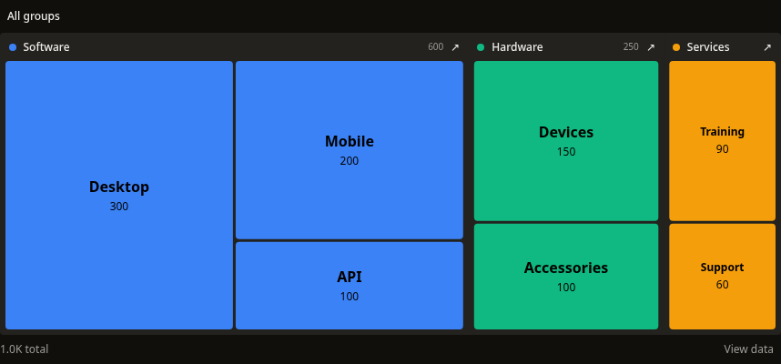
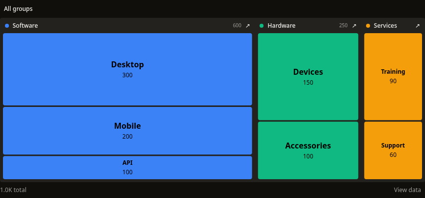
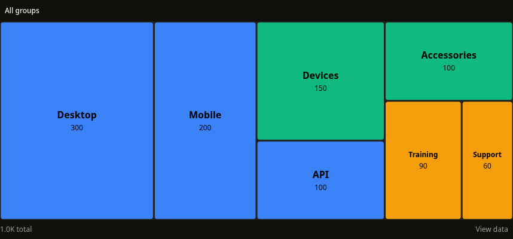
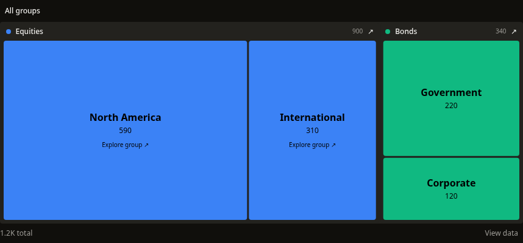
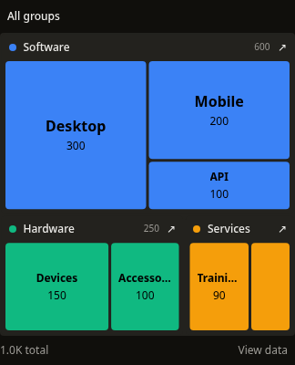
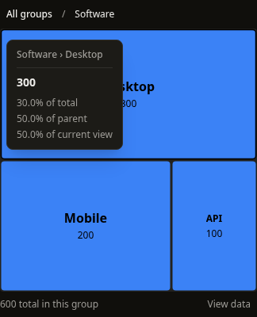
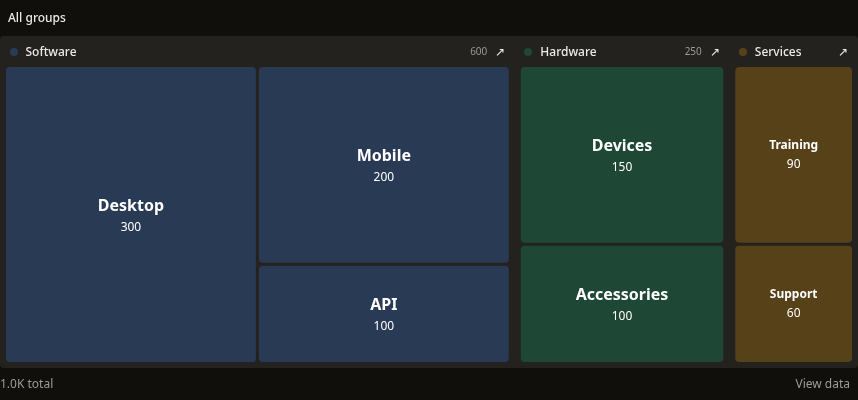
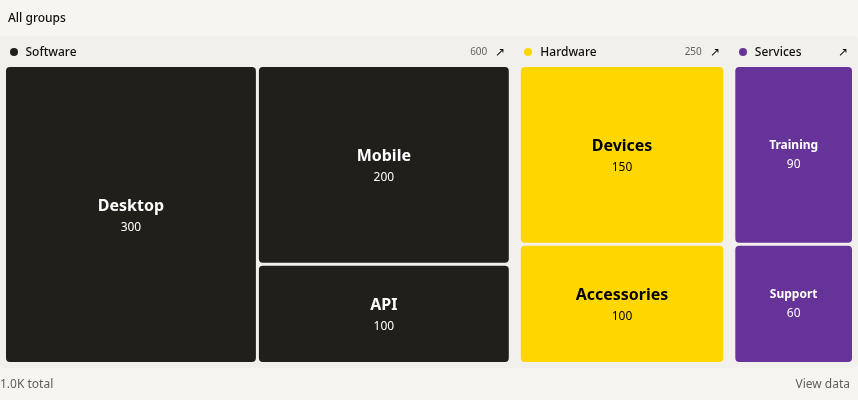

# TreeMapChart v1

Implemented September 13, 2026, after the approved Funnel/Sankey commit `6f88d79`.
The twelve-chart registry is unchanged in scope. WaterfallChart remains for a later pass.

## Findings and references

The former squarification heuristic mixed raw value weights with pixel dimensions,
so its aspect-ratio comparison did not evaluate the actual candidate rectangles.
Group names disappeared when children were rendered. Hex alpha concatenation broke
named colors and CSS variables, while theme foreground text could have poor contrast
against colored tiles. Every tile was a tab stop, inspection used mouse coordinates
for keyboard focus, and loading/error/empty returns replaced the measured root.

[D3's treemap documentation](https://d3js.org/d3-hierarchy/treemap) describes recursive
area subdivision, squarified tiling, balanced binary splits, alternating slice-and-dice,
and the role of padding. Those distinctions inform the three layout choices here.
[Highcharts' treemap documentation](https://www.highcharts.com/docs/chart-and-series-types/treemap)
provides a reference for hierarchy levels and exploring groups. The implementation
uses owned layout helpers; no chart dependency was added.

## Geometry and hierarchy

- `layout="squarified" | "binary" | "slice-dice"` tiles positive values with one
  area scale within each allocation. Zero values receive no painted area. The
  squarified row heuristic uses pixel areas and the remaining rectangle's short side.
- `variant="nested"` preserves group headers and recursively tiles their children.
  `maxDepth` controls 1–6 visible levels; small groups collapse into explorable tiles.
  Nested headers/insets consume space, so compare siblings within a group.
- `variant="flat"` tiles all leaves in the current view on a shared area scale.
  Setting `gap={0}` and `borderRadius={0}` gives exact rectangular area comparison
  across leaves. Gutters and rounded corners intentionally remove painted area.
- Groups sum children and ignore a supplied parent value. Leaves require finite,
  nonnegative numbers. Missing values, cycles, excessive depth, and overflowing
  totals produce actionable errors. Empty child arrays without values are valid
  zero groups. The validation pass caps hierarchy depth at 64 levels.
- Sorting affects layout, not original observation identity or branch colors.
  Numeric index paths distinguish repeated names and full name paths remain available.
- Group activation opens its children. Breadcrumbs return to ancestors and Backspace
  returns from the chart. A fresh data array resets navigation to the root.

## Labels, motion and interaction

Labels stay inside their tiles and use truncation or hide when space is insufficient.
Their ink is black or white, chosen against browser-resolved color composited over
the neutral plot surface. A palette-level canvas resolver handles CSS variables,
named colors, alpha, and theme changes without a separate canvas for every tile.
Branch colors remain stable during sorting and navigation; a node color overrides
its subtree.

Tiles grow from their centers using native SVG transforms and a shared motion value.
Opacity remains constant. Labels stay stationary, hover and resize do not replay
entrance, and reduced motion/focus finish it immediately. Refreshing preserves the
current geometry; initial loading has a grouped skeleton. The outer frame persists
through empty, zero, loading and error states.

The chart has one roving tile tab stop. Arrows inspect, Home/End jump, Escape dismisses,
and Enter/Space selects or opens groups. Pointer/touch activation uses the same
original node/path callback. Focus moves into a group after keyboard navigation.

View data exposes every observation under the current scope, including zero, tiny,
and collapsed descendants. It explicitly notes that group rows include their
children. Its selectable rows preserve original callbacks. Escape closes the data
panel and returns focus to its trigger. Tooltips are measured and bounded by the
chart frame, including on narrow screens.

## API and migration

Existing `data`, `colors`, `height`, `className`, `loading`, `error`, `animation`,
`onClick(node, path)` and `tooltipRenderer` remain. Added layout/view/order controls,
visible depth, gutters/corners, value/percentage labels, group navigation, formatter,
and accessible name/description.

`TreemapChartTooltipData<T>` now includes original `node`, `indexPath`, `depth`,
`parentPercentage`, and `viewPercentage`. `percentage` still means share of the
whole hierarchy and is now nullable for zero totals; use optional chaining or a
null fallback in custom inspection. Parent and current-view shares are also nullable.
The `TreeMapNode` type adds an optional CSS color. The export remains `TreeMapChart`
and the existing `/docs/components/treemap` URL remains unchanged.

## Validation

- **928 tests in 70 suites pass**, including 43 treemap interaction/layout/model tests.
  New invariants cover allocated area, containment, nonoverlap, scaling, group totals,
  duplicate identity, stable colors, cycle detection and zero values.
- Scoped ESLint and strict TypeScript pass. Global ESLint retains **26 errors and
  23 warnings** in unrelated existing code, down from the previous 27/23 baseline.
- Production Next.js/CLI and Storybook builds pass.
- Compiled CLI smoke installs **48 files** with all required helpers/dependencies
  and no unresolved monorepo-relative imports.
- A clean React 18 consumer installs TreeMapChart through the compiled CLI and passes
  strict TypeScript with immutable hierarchy data, callbacks, nullable percentages,
  and rejection of invalid layouts, leaf value types, and missing names.
- Production Chromium QA covers all three layouts, flat/nested views, keyboard
  drill-down/return, repeated/deep/long/120-node fixtures, tiny/zero data, invalid input,
  state recovery, theme changes, CSS/transparent colors, and mobile width. No page or
  console errors were observed. Native touch drills, selects a leaf, and returns.
- Motion sampling captured **38 distinct growth transforms** with constant opacity.
- The known Node 26/tsx `dev:cli` watcher failure (`unicorn-magic
  ERR_PACKAGE_PATH_NOT_EXPORTED`) remains unrelated; the compiled CLI passes.

Registry, markdown/LLM artifacts and fallback code are generated with
`npm run build:registry` (40 artifacts). Both new helpers, `model.ts` and `ink.ts`,
are included in distribution. Screenshots were captured from the production build.
The user's existing `package-lock.json` diff was preserved.

The app was left running on port 3100 and opened at `/docs/components/treemap`.
